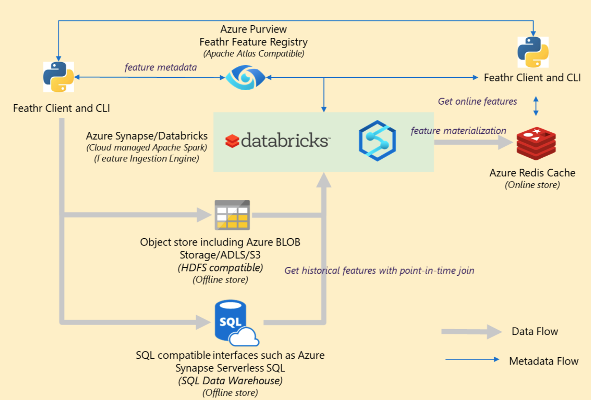

Feathr – An Enterprise-Grade, High Performance Feature Store
===========================================

## What is Feathr?

Feathr lets you:
* **define features** based on raw data sources, including time-series data, using simple [HOCON](https://github.com/lightbend/config/blob/main/HOCON.md) configuration 
* **get those features by their names** during model training and model inferencing,
using simple APIs
* **share features** across your team and company

Feathr automatically computes your feature values and joins them to your training
data, using point-in-time-correct semantics to avoid data leakage, and supports materializing and deploying
your features for use online in production.

Follow the [quick-start-guide](docs/quickstart.md) to try it out.
For more details, read our [documentation](https://linkedin.github.io/feathr/).

## Defining Features with Transformation
In **features.conf**:
```
anchors: {                                          // Feature anchors
    trip_features: {                                // A feature anchor
        source: nycTaxiBatchSource
        key: DOLocationID
        features: {                                 // Feature names in this anchor
            f_is_long_trip: "trip_distance > 30"    // A feature by an expression
            f_day_of_week: "dayofweek(datetime)"    // A feature with built-in function
        }
    }
}
```

## (Optional) Deploy Features to Online (Redis) Store
With CLI tool: `feathr deploy`

## Accessing Features
In **feature-join.conf**:
```
// Request dataset, used to join with features 
observationPath: "abfss://feathr@feathrazure.windows.net/demo_input/"

// Requested features to be joined 
features: [      
    {
        // features defined in your features.conf
        featureList: [f_is_long_trip, f_day_of_week] 
    }
]

// The output become the training dataset with features joined
outputPath: "abfss://feathr@feathrazure.windows.net/demo/demo_output/"
```

In **my_offline_training.py**:
```python
# Prepare training data by joining features to the input (observation) data.
# feature-join.conf and features.conf are detected and used automatically.
from feathr import FeathrClient
client = FeathrClient()
result = client.get_offline_features()
```

In **my_online_model.py**:
```python
from  feathr import FeathrClient
client = FeathrClient()
# Get features for a locationId (key)
client.get_online_features(feature_table = "agg_features", 
                           key = "265",
                           feature_names = ['f_location_avg_fare', 'f_location_max_fare'])
# Batch get for multiple locationIds (keys)
client.multi_get_online_features(feature_table = "agg_features",
                                 key = ["239", "265"],
                                 feature_names = ['f_location_avg_fare', 'f_location_max_fare'])

```


# More on Defining Features

## Defining Window Aggregation Features
```
anchors: {
    agg_features: {                        // A feature anchor (with aggregation)
        source: nyc_taxi_batch_source      // Features data source
        features: {
            f_location_avg_fare: {         // A feature with window aggregation
                aggregation: AVG           // Aggregation function
                def: "cast_float(fare_amount)"  // Aggregation expression
                window: 3d                 // Over a 3-day window
            }
        }
        key: LocationID                    // Query/join key of the feature(group)
    }
}
```

## Defining Named Raw Data Sources
```
sources: {                            // Named data sources
    nyc_taxi_batch_source: {          // A data source
        location: { path: "abfss://feathr@feathrazure.windows.net/demo_data/" }
        timeWindowParameters: {       // Time information of the data source
            timestampColumn: "dropoff_datetime"
            timestampColumnFormat: "yyyy-MM-dd HH:mm:ss"
        }
    }
}
```

## Beyond Features on Raw Data Sources - Derived Features
```
// Features that depend on other features instead of external raw data sources
derivations: {    
    f_trip_time_distance: {    // Name of the derived feature
        definition: "f_trip_distance * f_trip_time_duration"
        type: NUMERIC
    }
}
```


## Cloud Architecture
Feathr has native integration with Azure and other cloud services, and here's the high-level architecture to help you get started.


## Roadmap
>`Public Preview` release doesn't guarantee API stability and may introduce API changes.

- [x] Private Preview release
- [x] Public Preview release
- [ ] Alpha version release
  - [ ] Support streaming and online transformation
  - [ ] Support feature versioning
  - [ ] Support more data sources


## Community Guidelines
Build for the community and build by the community. Check out [community guidelines](CONTRIBUTING.md).

Join our [slack](https://join.slack.com/t/feathrai/shared_invite/zt-14sxrbacj-7qo2bKL0LVG~4m0Z8gytZQ) for questions and discussions.
