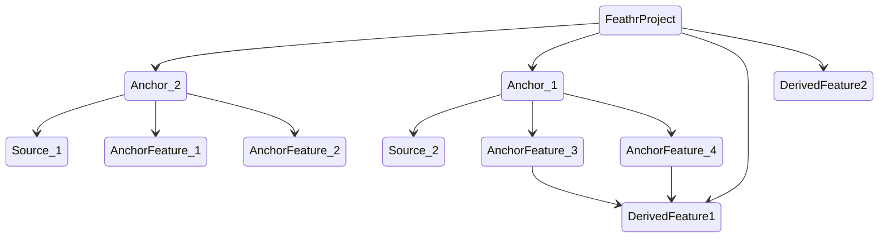

# Feathr Concepts Guide for Beginners

In this guide, we will cover the high level concepts for Feathr. Don't treat this as a user manual, but treat this as blogpost to cover the thinkings.

## What are Observation data, Feature Join, Feature Query, Keys, in Feathr's context?
In order to fully utilize Feathr's power, we need to understand the object models that Feathr is expecting. 

In Feathr, always think that there's some "Observation" dataset which is the central dataset that you will be using. This dataset usually have labels in it, but it's also fine that an observation data doesn't have a label.

For example, the observation dataset can be user click streams, credit card transactions, etc.

Then you will need addtional data (or feature) to augment this "observation" dataset. For example, you want to augment the user click stream data by adding some historical features, such as the total amount that the user spent in the last one week. This additional dataset is usually in a different storage, say in your historical database, or data lake.

In this case, how would we "link" the "observation" dataset, and the "additional dataset"? This is called "Feature Join" in Feature Store, but basically it's joining two tables.

Since this is a Join process, we need to specify which key(s) that the join would happen. Those keys are usually some IDs, but can be others as well. In the above example, if we want to augment the user click stream data with purchase history, we will use the user ID as key. Other cases might be we want to get the historical blood pressure history for a patient, so patient ID will be used as key in that case.

Since the additional features are from different sources, we want to define a `Anchor` to process it further. Think `Anchor` as a `Feature View`, where it sits on top of the raw data source and have some possible transformations. `Anchor` also has preprocess capabilities, where you can process the raw data from its source with customized PySpark functions.

That's why you will see something like:

```python

batch_source = HdfsSource(name="nycTaxiBatchSourcePurview",
                          path="wasbs://public@azurefeathrstorage.blob.core.windows.net/sample_data/feathr_delta_table",
                          event_timestamp_column="lpep_dropoff_datetime",
                          timestamp_format="yyyy-MM-dd HH:mm:ss")

f_trip_distance = Feature(name="f_trip_distance",
                          feature_type=FLOAT, transform="trip_distance", 
                          )
f_trip_time_duration = Feature(name="f_trip_time_duration",
                               feature_type=INT32,
                               transform="time_duration(lpep_pickup_datetime, lpep_dropoff_datetime, 'minutes')")
features = [
    f_trip_distance,
    f_trip_time_duration,
    Feature(name="f_is_long_trip_distance",
            feature_type=BOOLEAN,
            transform="cast_float(trip_distance)>30"),
    Feature(name="f_day_of_week",
            feature_type=INT32,
            transform="dayofweek(lpep_dropoff_datetime)"),
]

request_anchor = FeatureAnchor(name="request_features",
                               source=batch_source,
                               features=features)
```

In the above code, we have a datasource that is an HDFS style source, indicating where we will get data from. We also define a few features on top of those source data, for example we can simply do renaming (`f_trip_distance` is a rename of `trip_distance`), pre-processing, etc. 

## Motivation on Derived Feature

That sounds all good, but what if we want to compute something that is across two "Feature View"/"Anchor"s? Let's say in the above example, we want to calculate a feature that based on two input features, and those features are not in the same anchor (so you cannot use "preprocessing" in Anchor to pre calculate it). Here's why there is a concept in Feathr called "derived features", which allows you to calculate features based on other features, with transformation. For example, 

```python
f_trip_time_distance = DerivedFeature(name="f_trip_time_distance",
                                      feature_type=FLOAT,
                                      input_features=[
                                          f_trip_distance, f_trip_time_duration],
                                      transform="f_trip_distance * f_trip_time_duration")
```

## What if I want to get features from "Observation" data?

There are a lot of use cases where users want to calculate features based on input features as well. Users can simply 


- What if we want to directly get features from the input data? INPUT_CONTEXT
- self join.


Additional datathat have additional features, which you want to augment the centralized dataset. For example, user purchase history, total spending in the past month.

## Feature Joins to get all the historical dataset/get offline dataset

we need to specify a key in feature join, and for each feature query, the key needs to be the same, because each feature join is like augmenting the "observation" dataset by additional feature from other tables once more.


## Point in time joins and aggregations
- Talk why do we need a timestamp column and point in time join.

## Feature Registry


## others

Talk about feathr object model

- projects, anchors, relationships, feature tables, etc.


