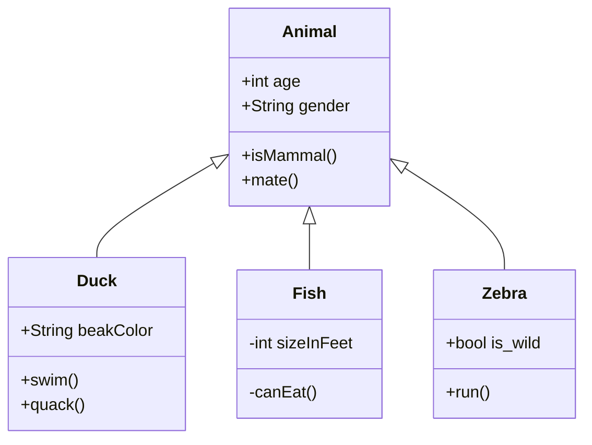

# Feathr Concepts for Beginners

Talk about Feathr data model
- Observation data, why doingg joins, etc.

Additional datathat have additional features, which you want to augment the centralized dataset. For example, user purchase history, total spending in the past month.

Deep learning scenario? 

Talk about feathr object model

- projects, anchors, relationships, feature tables, etc.

