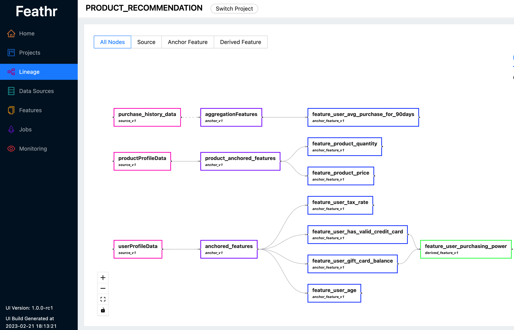

# Feature Registry and Feathr UI

Feature registry is an important component of a feature store. This documentation will cover the supported backend of a feature registry and the usages.

## Introduction

Feathr UI and Feathr Registry are two optional components to use Feathr, but usually they are recommended to be provisioned so that Feathr users can explore features that are already registered in the registry, and reuse those features. Feathr UI and the registry component allows end users to:

- Identity Data Sources for features
- Search features and explore feature metadata details
- Track project and feature level lineage data
- Manage access control
- Register and share features across team members

## Deployment

Please follow the `Provision Azure Resources using ARM Template` part in the [Azure Resource Provisioning document](../how-to-guides/azure-deployment-arm.md#provision-azure-resources-using-arm-template) to provision corresponding the Azure resources. After completing those steps, you should have a set of resources that can be used for Feature Registry.

In case you want to do it in a more customized way, you can use [this Dockerfile](https://github.com/feathr-ai/feathr/blob/main/FeathrRegistry.Dockerfile) to deploy the REST API and UI. This docker image is more for illustration purpose, and you can customize it further (like building the REST API and UI in separate docker images).

If you use [Azure Resource Provisioning document](../how-to-guides/azure-deployment-arm.md#provision-azure-resources-using-arm-template) to provision the resources, you should be able to access the UI in this website:

```bash
https://{prefix}webapp.azurewebsites.net
```

And the corresponding REST API will be:

```bash
https://{prefix}webapp.azurewebsites.net/api/v1
```

## Deployment Options

Feathr supports two types of backends for Feature Registry - Azure Purview (Apache Atlas compatible service) and ANSI SQL. Depending on your IT setup, you might choose either of those in the above deployment steps.

Note that if you choose to enable Role-based Access Control (RBAC), you still need to use a SQL service (such as Azure SQL) to store all the RBAC related information.

## Architecture

The overall Feathr architecture is like below. The registry and UI part is illustrated on the top where there are three components for Feathr feature registry:


- Feathr UI, a React based application
- Feathr REST API, which provides abstraction for different registry providers, as well as role-based access control (RBAC). Both the Feathr UI and the Feathr Python Client interact with the Feathr REST API service. The REST API service then detect if the user has the right access, and route the corresponding request to the registry providers.
- Different feature registry backends. Currently only Azure Purview and SQL based registry are supported, but more registry providers from the community are welcome.

## Accessing Registry in Feathr Python Client

In the Feathr python client, if you want to access the registry, you should set the `FEATURE_REGISTRY__API_ENDPOINT` environment variable. The full [document is here](../how-to-guides/feathr-configuration-and-env.md#a-list-of-environment-variables-that-feathr-uses).

Alternatively, you can set the feature registry and the API endpoint in the configuration YAML file:

```yaml
feature_registry:
  # The API endpoint of the registry service
  api_endpoint: "https://<replace_with_your_feathr_api_endpoint>.azurewebsites.net/api/v1"
```

### Register and List Features

You can register your features in the centralized registry and share the corresponding project with other team members who want to consume those features and for further use. You can also use `list_registered_features` to verify if they have been registered successfully.

```python
client.build_features(anchor_list=[agg_anchor, request_anchor], derived_feature_list=derived_feature_list)
client.register_features()
all_features = client.list_registered_features(project_name=client.project_name)
```

Please avoid applying the same name to different features under a certain project, since it will be treated as updating an exsiting project which is not supported by feathr and will cause errors.

### Reuse Features from Existing Registry

The feature producers can just let the feature consumers know which features exist so the feature consumers can reuse them. For feature consumers, they can reuse existing features from the registry. The whole project can be retrieved to local environment by calling this API `client.get_features_from_registry` with a project name. This encourages feature reuse across organizations. For example, end users of a feature just need to read all feature definitions from the existing projects, then use a few features from the projects and join those features with a new dataset you have.

For example, in the [product recommendation demo notebook](https://github.com/feathr-ai/feathr/blob/main/docs/samples/azure_synapse/product_recommendation_demo.ipynb), some other team members have already defined a few features, such as `feature_user_gift_card_balance` and `feature_user_has_valid_credit_card`. If we want to reuse those features for anti-abuse purpose in a new dataset, we can simply call `get_features_from_registry` to get the features, then put the features you want to query to the anti-abuse dataset you have.

```python
registered_features_dict = client.get_features_from_registry(client.project_name)

# Features that we want to request
feature_query = FeatureQuery(feature_list=[ "feature_user_gift_card_balance",
                                           "feature_user_has_valid_credit_card", ],
                             key=user_id)
settings = ObservationSettings(
    observation_path="some_anti_abuse_dataset_path",
    event_timestamp_column="event_timestamp",
    timestamp_format="yyyy-MM-dd")
feathr_client.get_offline_features(observation_settings=settings,
                            feature_query=feature_query,
                            output_path=output_path)
```

## Accessing Feathr UI

Feathr UI should be straightforward to use. Currently there are a few pages, including:

### Feature Summary page

You can see a list of all the features in a project:


### Feature Detailed Page

You can view the detailed information for a feature:


### Feature Lineage Page

You can view all the lineage info for features in a project.


### Access Control Management Page

If RBAC is enabled, admins can manage access control for users.

