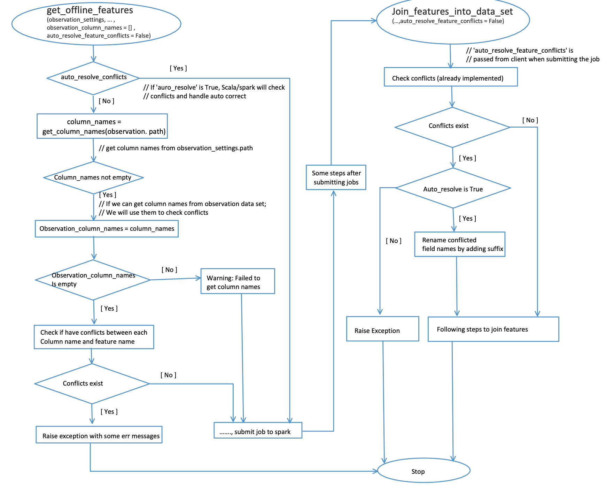

# Getting Offline Features using Feature Query

## Intuitions

After the feature producers have defined the features (as described in the [Feature Definition](./feature-definition.md) part), the feature consumers may want to consume those features.

For example, the dataset is like below, where there are 3 tables that feature producers want to extract features from: `user_profile_mock_data`, `user_purchase_history_mock_data`, and `product_detail_mock_data`.

For feature consumers, they will usually use a central dataset ("observation data", `user_observation_mock_data` in this case) which contains a couple of IDs (`user_id` and `product_id` in this case), timestamps, and other columns. Feature consumers will use this "observation data" to query from different feature tables (using `Feature Query` below).


As we can see, the use case for getting offline features using Feathr is straightforward. Feature consumers want to get a few features - for a particular user, what's the gift card balance? What's the total purchase in the last 90 days; Feature consumers can also get a few features for other entities in the same `Feature Query`. For example, in the meanwhile, feature consumers can also query the product feature such as product quantity and price.

In this case, Feathr users can simply specify the feature name that they want to query, and specify for which entity/key that they want to query on, like below. Note that for feature consumers, they don't have to query all the features; instead they can just query a subset of the features that the feature producers have defined.

```python
user_feature_query = FeatureQuery(
    feature_list=["feature_user_age",
                  "feature_user_tax_rate",
                  "feature_user_gift_card_balance",
                  "feature_user_has_valid_credit_card",
                  "feature_user_total_purchase_in_90days",
                  "feature_user_purchasing_power"
                  ],
    key=user_id)

product_feature_query = FeatureQuery(
    feature_list=[
                  "feature_product_quantity",
                  "feature_product_price"
                  ],
    key=product_id)
```

And specify the location for the observation data:

```python
settings = ObservationSettings(
    observation_path="wasbs://public@azurefeathrstorage.blob.core.windows.net/sample_data/product_recommendation_sample/user_observation_mock_data.csv",
    event_timestamp_column="event_timestamp",
    timestamp_format="yyyy-MM-dd")
```

And finally, specify the feature query and finally trigger the computation:

```python
client.get_offline_features(observation_settings=settings,
                            feature_query=[user_feature_query, product_feature_query],
                            output_path=output_path)

```

More details for the above APIs can be read from:

- [ObservationSettings API doc](https://feathr.readthedocs.io/en/latest/feathr.html#feathr.ObservationSettings)
- [client.get_offline_feature API doc](https://feathr.readthedocs.io/en/latest/feathr.html#feathr.FeathrClient.get_offline_features)

## More on `Observation data`

The path of a dataset as the 'spine' for the to-be-created training dataset. We call this input 'spine' dataset the 'observation' dataset. Typically, each row of the observation data contains:

1. **Entity ID Column:** Column(s) representing entity id(s), which will be used as the join key to query feature value.

2. **Timestamp Column:** A column representing the event time of the row. By default, Feathr will make sure the feature values queried have a timestamp earlier than the timestamp in observation data, ensuring no data leakage in the resulting training dataset. Refer to [Point in time Joins](./point-in-time-join.md) for more details.

3. **Other columns** will be simply pass through to the output training dataset, which can be treated as immutable columns.
## More on `Feature Query`

After you have defined all the features, you probably don't want to use all of them in this particular program. In this case, instead of putting every features in this `FeatureQuery` part, you can just put a selected list of features. Note that they have to be of the same key.

## Feature names conflicts check 

If any of feature names provided by `Feature Query` conflict with column names of the 'observation' dataset, this 'get_offline_features' job will fail. It can cost several minutes to get this failure from spark. To avoid this slowness,feathr support to check if any of these conflicts exist before submitting the job to cloud.

The checking steps are:
1. Check if the `conflicts_auto_correction` in the `observation_settings`is set (default by None). If it's not None, it means spark will handle checking and solving these conflicts. In this case, python client side will submit this job to spark directly. Otherwise, it will go to the below steps. In terms of `conflicts_auto_correction`, it also contains two parameters, `rename_features` and `suffix`. By default, spark will rename dataset columns with a suffix "_1". You may rename feature names by set `rename_features` to True and provide a customized suffix.
   
An example of `ObservationSettings` with auto correction enabled:
```
settings = ObservationSettings(
    observation_path="wasbs://...",
    event_timestamp_column="...",
    timestamp_format="yyyy-MM-dd HH:mm:ss",
    conflicts_auto_correction=ConflictsAutoCorrection(rename_features=True, suffix="test"))
 
```
   
2. Try to load dataset without credential and compare column names with feature names. This is to support the case when the dataset is saved in a public storage.
3. If cannot load the dataset in the first step, will try to load it with credential anc compare column names with feature names. It can only support loading files from storages requiring credential your environment defined. For example, if your `spark_cluster` is `databricks`, it can only load dataset under the 'dbfs' path belonging to this databricks.
4. If cannot load the dataset from step1 and step2, will try to compare column names provided by the parameter `dataset_column_names` if it's not empty.
5. If cannot get column names from above 3 steps, will show a warning message and submit the job to cloud. The spark will also check this kind of conflicts.
6. If any conflicts found in step 1 to 3, will throw an exception and the process will be stoped. To solve these conflicts, you may either change related dataset column names or change feature names. If you decide to change feature names and you have registered these features, you may need to register them again with updated names and a new project name. 

Workflow graph for the conflicts checking and handling:


For more details, please check the code example as a reference:
[conflicts check and handle samples](../samples/feature_naming_conflicts_samples.py)

## Difference between `materialize_features` and `get_offline_features` API

It is sometimes confusing between "getting offline features" in this document and the "[getting materialized features](./materializing-features.md)" part, given they both seem to "get features and put it somewhere". However there are some differences and you should know when to use which:

1. For `get_offline_features` API, feature consumers usually need to have a central `observation data` so they can use `Feature Query` to query different features for different entities from different tables. For `materialize_features` API, feature consumers don't have the `observation data`, because they don't need to query from existing feature definitions. In this case, feature consumers only need to specify for a specific entity (say `user_id`), which features they want to materialize to offline or online store. Note that for a feature table in the materialization settings, feature consumers can only materialize features for the same key for the same table.

2. For the timestamps, in `get_offline_features` API, Feathr will make sure the feature values queried have a timestamp earlier than the timestamp in observation data, ensuring no data leakage in the resulting training dataset. For `materialize_features` API, Feathr will always materialize the latest feature available in the dataset.

3. Those two APIs are used in two different stage of feature engineering pipeline, and serves different purpose. For `get_offline_features`, it is usually to get data for model training and usually is focused on getting historical data from an offline storage; while for `materialize_features`, it is usually to pre-compute features for model inference via online store.
