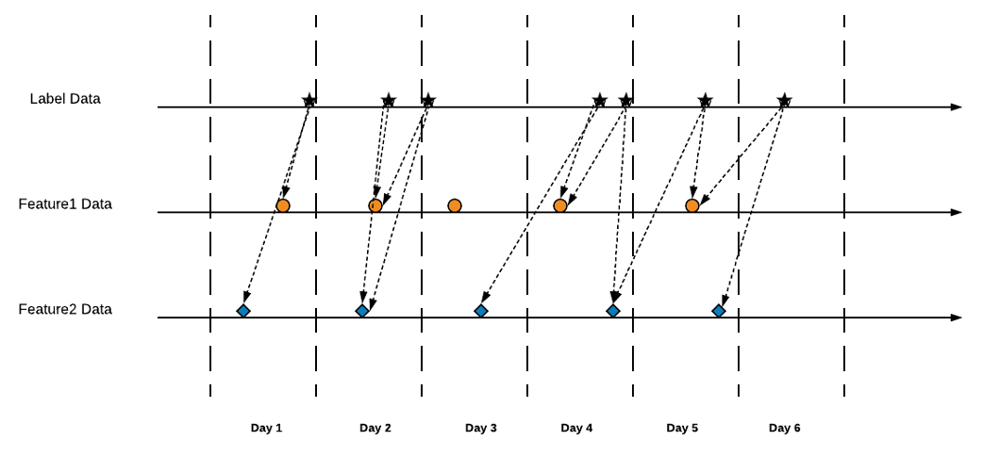

# Point-in-time Correctness
If your feature doesn't change over time in your modeling, like an adult's height, then point-in-time is not an issue. In reality, most features change over time, and you should care about point-in-time correctness. Like a person's salary, a person's purchases on the website. They all change over time. We call those features time-series features. For time-series features, point-in-time correctness is critical.

## Feature Leakage
Models should not use future to predict present. This is called feature leakage. For example, you have an observation data with a timestamp of 7 days ago. In the eyes of this observation data, 7 days ago is its present. On the other side, you have time-series feature data keep ingested into your data warehouse and it contains recent purchase data from 2 days ago. In the eys of the observation data, all these newly ingested data during the last week is the future feature. If you just blindly use the latest feature data in your model, you are leaking future data into your model. This mistake happens more often than people think.

The model will perform better during training(usually), but it will not perform as good during online serving. Why? There is no future data on online serving anymore.

## Point-in-time Correctness
Point-in-time corretness ensures that no future data is used for training.

Point-in-time correctness can be achieved via two approaches. If your observation data has a global timestamp for all observation events, then you can simply time-travel your feature dataset back to that timestamp. If your observation data has different timestamps for each observation events, then you need to point-in-time join for each events. The first approach is easier to implement but have more restrictions(global timestapm). The second appraoche provides better flexiblity and no feature data is wasted. Feathr uses the second approach and can scale to large datasets.

## Point-in-time Feature Lookup in Feathr
To illustrate the power of point-in-time feature lookup in Feathr, consider the following (dummy) scenario, where:

- the label(observation) data spanned across multiple days
- the feature data also spanned across multiple days
- In the label data, there might be multiple occurrences of the same `UserId` with different labels(responses), due to the fact that the same users might have had multiple responses at different time. In the example below, both user 1 and user 3 are duplicated (and have tracking id of 4 and 5):

_Label dataset_

| TrackingID | UserId | Label | Date  |
| ---------- | ------ | ----- | ----- |
| 1          | 1      | 0     | 05/01 |
| 2          | 2      | 1     | 05/01 |
| 3          | 3      | 1     | 05/02 |
| 4          | 1      | 1     | 05/03 |
| 5          | 3      | 0     | 05/03 |

Meanwhile, we would like to lookup another feature called X feature on UserId for the label data. Assuming this feature is generated daily:

_X feature dataset_

| UserId | X | DateX  |
| ------ | ---------------------- | ----- |
| 1      | 0.5                    | 2022/05/01 |
| 2      | 0.3                    | 2022/05/01 |
| 3      | 0.1                    | 2022/05/01 |

| UserId | X | DateX  |
| ------ | ---------------------- | ----- |
| 1      | 0.4                    | 2022/05/02 |
| 2      | 0.2                    | 2022/05/02 |
| 3      | 0.1                    | 2022/05/02 |

| UserId | X | DateX  |
| ------ | ---------------------- | ----- |
| 1      | 0.3                    | 2022/05/03 |
| 2      | 0.2                    | 2022/05/03 |
| 3      | 0.15                   | 2022/05/03 |

We would like to lookup the feature with the label data in a way so that for the same key, each label is given the feature value that is **closest from the past** :

_Result after point-in-time join_

| TrackingID | UserId | Label | Date  | X |
| ---------- | ------ | ----- | ----- | ---------------------- |
| 1          | 1      | 0     | 05/01 | 0.5                    |
| 2          | 2      | 1     | 05/01 | 0.3                    |
| 3          | 3      | 1     | 05/02 | 0.1                    |
| 4          | 1      | 1     | 05/03 | 0.3                    |
| 5          | 3      | 0     | 05/03 | 0.15                   |

As you can see, for each tracking ID, we get the latest data based on the Date column.

## Using Point-in-time Lookup in Feathr
Using the above example, you can define point-in-time lookup in this way:
```
anchors: {
  ...
  myAnchor: {
    source: “myXSource”
    key: “userId”
    features: {
      feature_X: {
        def: “x”
        aggregation: LATEST
        window: 7d        // Defines the farest time range you want to lookup for. Data beyond this window won't be used.
      }
    }
  }

sources: {
  “myXSource”: {
    type: "ADLS"
    location: { path: "/path/to/your/feature/data/daily" }
    timeWindowParameters: {
      timestamp: "DateX"        // field of your timestamp
      timestamp_format: "yyyy/MM/DD"        // format of timestamp. It can be human readable format or epoch(in seconds)
    }
  }
}
```
And your join config:
```
settings: {
  joinTimeSettings: {
    timestampColumn: {
      def: "Date"        // timestamp field for your observation data
      format: "MM/DD"    // teimstamp field format of your observation/label data
    }
  }
}
features: [
  {
    key: UserId
    featureList: [
      feature_X,
    ]
  }
]
```

## Advanced Point-in-time Lookup
We plot observation dataset and feature data for a same entity key on the same timeline：


In the above example, we used `LATEST` as the aggregation type. `LATEST` means to grab the latest(closest to observation timestamp) feature data in the window. For all other window aggregation types, point-in-time correctness is also guaranteed. For example, `SUM`, we only sum the data in the window closest to the observation timestamp but not ahead of the observation timestamp.

