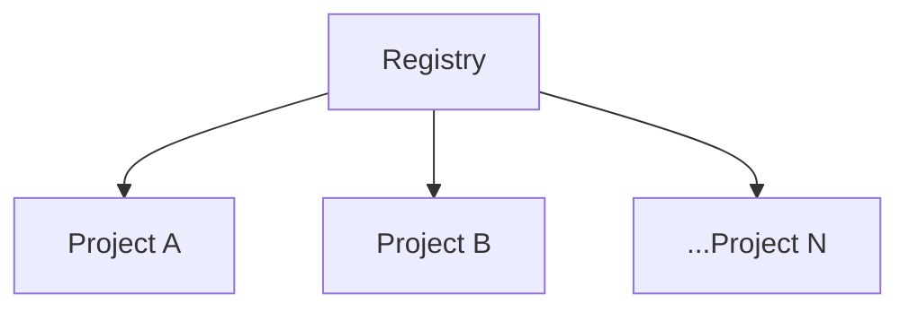

# Feathr Registry Access Control

A project level role based access control (RBAC) plugin is available to help you manage who have access to **Feathr Registry**.

It provides a simple authorization system built on OAuth tokens along with a SQL database as backend storage for `userrole` records.

## How Registry Access Control works?

With Registry Access Control, you can
- Share your project metadata(read-only) by assigning `consumer` role.
- Invite contributors to update features in this project by assigning `producer` role.
- Transfer project admin by assigning `admin` role.

### Scope

_Scope_ is the set of resources that the permission applies to. In Feathr, you can specify a scope at 2 levels: **registry**, **project**. Lower levels inherit role permissions from higher levels.

When you specify the scope in role assignment, please use `global` for registry level scope and `{project name}` for project level scope.

Feature level access control is **NOT** supported yet. Users are encouraged to group features with similar access control rules in one project.

### Role

A _role_ is a collection of permissions. We have 3 built-in roles with different permissions:
| Role     | Description                | Permissions         |
| -------- | -------------------------- | ------------------- |
| Admin    | The owner of project       | Read, Write, Manage |
| Producer | The contributor of project | Read, Write         |
| Consumer | The reader of project      | Read                |

### Permission
_permission_ refers to the a certain kind of access to registry metadata or role assignment records.
| Permission | Description                                               |
| ---------- | --------------------------------------------------------- |
| Read       | Read registry meta data; `GET` Registry APIs              |
| Write      | Write registry meta data; `POST` Registry APIs            |
| Manage     | Create and manage role assignment records with management APIs |

### User
A _user_ can be an email account or an AppId. 

All Registry API requests requires `token` in header to identify the requestor and validate the permission.
Feathr UI uses the id token of login account. While Feathr Client samples get token by `DefaultAzureCredential()`.

_Group_ is **NOT** supported yet. 

### Role Assignment

A _Role Assignment_ is the process of add a `user-role` mapping record into backend storage table.

[Feature Registry](https://linkedin.github.io/feathr/concepts/feature-registry.html#access-control-management-page) section briefly introduced the access control management page, where project admins can manage role assignments. 
Management APIs are not exposed in Feathr Client by design.

## How to enable Registry Access Control?
[Azure Resource Provisioning](https://linkedin.github.io/feathr/how-to-guides/azure-deployment-arm.html) section has detailed instructions on resource provisioning. For RBAC specific, you will:
1. Choose `Yes` for `Enable RBAC` in ARM Template.
2. Create a `userrole` table in provisioned SQL database with [RBAC Schema](../../registry/access_control/scripts/schema.sql).
3. Initialize the `userrole` table refer to commands in [test data](../../registry/access_control/scripts/test_data.sql).

For more details, please refer to the [Feathr Registry Access Control Gateway Specifications](../../../feathr/registry/access_control/README.md). 