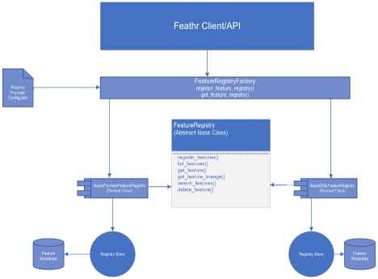

> **Feathr Registry Abstraction Design Proposal**

In our goal to support heterogeneous registry backends across cloud providers, we plan to abstract the interface for Feature Registry and have concrete implementations for different backends (like Purview and SQL). We will use Factory Patterns to allow for modular design on how to register these providers and get the right client during initialization. By implementing Object Factory pattern and providing a registration interface, we can support new backends without changing any of the existing application code. This minimizes the risk of breaking existing
features or introducing bugs.



Here is the Interface definition for Feature Registry, it is an abstract class in Python and each member method labelled as \@abstractmethod needs to be implemented by the subclasses. This includes the basic
functionality that we intend to support for a registry.

__FeatureRegistry Base Class__
```python
from abc import ABC, abstractmethod
class FeatureRegistry(ABC):
    
    @abstractmethod
    def register_features(self, workspace_path, from_context):
        """Register Features for the specified workspace"""
        pass

    @abstractmethod
    def list_features(self, project_name):
        """List Features for the specified workspace"""
        pass

    @abstractmethod
    def get_feature(self, guid, fqdn):
        """Get a feature by fqdn or guid"""
        pass

    @abstractmethod
    def get_feature_lineage(self, guid, fqdn):
        """Get feature lineage given a guid or fqdn"""
        pass

    @abstractmethod
    def search_features(self, search_term):
        """Search for features with provided search_term"""
        pass

    @abstractmethod
    def delete_feature(self, guid, fqdn):
        """Deletes a feature with a given name or guid"""
        pass


```
Here is a concrete implementation of the above interface for Azure
Purview. In Python you extend a base class by passing it as parameter to
derived class ex: class DerivedClass(BaseClass)

__AzurePurviewFeatureRegistry Derived Class__
```python
from pyapacheatlas.core import PurviewClient

class AzurePurviewFeatureRegistry(FeatureRegistry):

    def __init__(self, purview_account_name, purview_account_key):
        self._purview_account_name = purview_account_name
        self._purview_account_key = purview_account_key

        self._purview_client = PurviewClient(
                account_name=self._purview_account_name,
                key=self._purview_account_key
            )  

    """Feathr Feature Registry using Azure Purview"""
    def register_features(self, workspace_path, from_context):
        """Register Features for the specified workspace"""
        pass

    def list_features(self, project_name):
        """List Features for the specified workspace"""
        pass

    def get_feature(self, guid, fqdn):
        """Get a feature by fqdn or guid"""
        pass

    def get_feature_lineage(self, guid, fqdn):
        """Get feature lineage given a guid or fqdn"""
        pass

    def search_features(self, search_term):
        """Search for features with provided search_term"""
        pass

    def delete_feature(self, guid, fqdn):
        """Deletes a feature with a given name or guid"""
        pass

```

To make the ObjectFactory more generic we could use an intermediate
Builder class, that overrides the \_\_call\_\_ method, accepts the
required parameters specific to the backend and ignores the rest. In
Python \_\_call\_\_() is used to resolve the code associated with a
callable object. A callable object is one which be called like a
function. We first define the interface for it so every concrete
implementation's \_\_call\_\_() method returns an instance of
FeatureRegistry.

__FeatureRegistryBuilder Class__
```python
from abc import ABC, abstractmethod
class FeatureRegistryBuilder(ABC):
    
    @abstractmethod
    def __call__(self, *_) -> FeatureRegistry:
        pass

```

Below is what Purview's implementation of FeatureRegistryBuilder would look like

__AzurePurviewFeatureRegistryBuilder__

```python
class AzurePurviewFeatureRegistryBuilder:
    def __init__(self):
        self._instance = None
    
    def __call__(self, purview_account_name, purview_account_key, *_):
        if not self.instance:
            self._instance = AzurePurviewFeatureRegistry(purview_account_name, purview_account_key)
        return self._instance


```

The Factory class would provide methods to register a registry provider
and a method to get a registry client instance given a provider type.

__FeatureRegistryFactory__

```python
class FeatureRegistryFactory():
    """
    Factory that represents the client for Feature Registry
    The factory doesn't maintain any of the instances it creates
    """
    def __init__(self):
        self._feature_registries = {}

    def register_feature_registry(self, key, feature_registry):
        self._feature_registries[key] = feature_registry

    def get_feature_registry(self, key, **kwargs) -> FeatureRegistry:
        """Returns a new feature registry instance"""
        registry = self._feature_registries.get(key)
        if registry:
            return registry(**kwargs)
        else:
            raise ValueError

```

Stitching them all together, different registry providers need to be registered with the factory instance
```python
factory = FeatureRegistryFactory()

factory.register_feature_registry('AzurePurview',
AzurePurviewFeatureRegistryBuilder())

factory.register_feature_registry('AzureSQL',
AzureSQLFeatureRegistryBuilder())
```
The factory creates a concrete implementation for the registry backend on the specified key parameter.

```python
config = {
    'purview_account_name': 'THE_PURVIEW_ACCOUNT_NAME',
    'purview_account_key': 'THE_PURVIEW_ACCOUNT_KEY',
    'sql_server_name': 'THE_SQL_SERVER_NAME',
    'sql_server_password': 'THE_SQL_SERVER_PASSWORD'
}

factory = FeatureRegistryFactory()
purview_client = factory.get_feature_registry('AzurePurview', **config)
purview_client.list_registered_features()
```

Following are the Data Models for Feature and Lineage defined in
Pydantic

__Feature Data Model Class__

```python
from typing import List,Dict
from pydantic import BaseModel
from typing import List, Optional, Union, Dict
from feathr.dtype import FeatureType
from feathr.transformation import Transformation
from feathr.typed_key import TypedKey


class Feature(BaseModel):  
    """
    Data Model for Feature
    """
    name: str
    fqdn: str   
    feature_type: FeatureType
    key: Optional[Union[TypedKey, List[TypedKey]]]
    transform: Optional[Union[str  , Transformation]]
    registry_tags: Optional[Dict[str, str]]

```


__Lineage Data Model Class__

```python
class Lineage(BaseModel):
    """
    Data Model for Feature Lineage
    """
    featureGuid: str
    lineageDirection: LineageDirection
    lineageDepth: int
    lineageWidth: int
    childrenCount: int
    parentRelations: List[ParentRelation]
    relations: List[LineageRelation]


class LineageRelation(BaseModel):
    fromEntityId: str
    toEntityId: str
    relationshipId: str

class ParentRelation(BaseModel):
    childEntityId: str
    parentEntityId: str
    relationshipId: str

class LineageDirection(Enum):
    INPUT = “input”
    OUTPUT = "output"
    BOTH = "both"

```

**References:**

<https://realpython.com/factory-method-python/>

<https://linkedin.github.io/rest.li/spec/protocol>

<https://docs.microsoft.com/en-us/rest/api/purview/catalogdataplane/lineage/get-lineage-graph#atlaslineageinfo>
