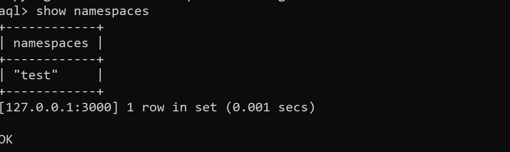

# About Aerospike

Aerospike is a distributed, scalable database. The architecture has three key objectives:

- Create a flexible, scalable platform for web-scale applications.
- Provide the robustness and reliability (as in ACID) expected from traditional databases.
- Provide operational efficiency with minimal manual involvement.

# Aerospike and Feathr

Feathr currently works with Azure Databricks and Azure Synapse. Aerospike, as a distributed database with spark support, could be a valid scenario that Feathr should be able to support. 

Feathr is currently expanding its usability and scalability by providing a provider model, which should support all spark-compatible data sources working as input/output for feature join and feature generation job. 

This includes: 
- Cosmos DB
- Aerospike
- ADLS Gen 2
- Sql 
- Azure Purview
- etc. 

# Setup Aerospike

Aerospike can be installed to Azure VM , and serve as database server. 

Guidance for VM installation: https://docs.aerospike.com/deploy_guides/azure

Aerospike also provides docker installation. The steps are: 

1. 	Setup aerospike docker 

	`docker run -d --name aerospike -p 3000-3002:3000-3002 aerospike:ce-6.0.0.2`

    'ce' means we are using Community Edition. 

1. Open docker terminal , type `bash` to enter bash mode, then test installation with AQL. (Aerospike query language, something similar to SQL. )


From the above, we can see Aerospike has been successfully started in the docker, with default namespace "test"


1. Verify Aerospike basic CRUD
Next we will verify the functionality of Aerospike database by performing basic CRUD. 
- Insert a new record in sql-like grammar, then select the new created record.


- Delete the record, and veirfy the deletion. 


# Other useful commands for monitoring Aerospike cluster
```
	# Show the features enabled in this database.
	asadm -e "features"
	
	# Display summary info for the cluster
	asadm -e "summary"
	
	# View the config
	asadm -e "show config"
```