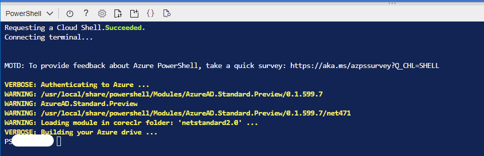

# Cloud Resource Provisioning

To simplify the cloud environment setup, we give end users an Azure template (with a button to have a simplified experience) so they can provision resources easily. From a high level point of view, it's a JSON file that Azure knows how to parse, and you specify the corresponding resources in the JSON file and Azure will validate and provision it for you.

The JSON file is located [here](../how-to-guides/deploy.json), and developers can paste it to the [Azure Template Manager](https://ms.portal.azure.com/#blade/HubsExtension/TemplateEditorBladeV2/template/) to run the template with updates they want to have.

The template contains a lot Azure specific terms, and more details can be found here for [Azure Templates](https://docs.microsoft.com/en-us/azure/azure-resource-manager/templates/overview). 

The JSON (ARM Template - Azure Resource Manager Template) file has been built from [Bicep language](https://docs.microsoft.com/en-us/azure/azure-resource-manager/bicep/overview?tabs=bicep) which is a domain-specific language (DSL) that uses declarative syntax to deploy Azure resources.

The Bicep files are here and has been translated with [deploy.json](../how-to-guides/deploy.json) file

Here is the simplest steps for deploying Feathr resources in your Azure Subscription and configure resources.  

## Step 1. [Launch Cloud Shell](https://shell.azure.com/powersehll)  

Open Azure Cloud Shell with Powershell environment.



## Step 2. Invoke Deployment Script  

Invoke Deployment Script from GitHub Repo with parameter for Azure Region.  
Available regions can be checked with this command

```powershell
    Get-AzLocation | select displayname,location
```

```powreshell  

    iwr https://raw.githubusercontent.com/linkedin/feathr/main/docs/how-to-guides/deployFeathr.ps1 -outfile ./deployFeathr.ps1; ./deployFeathr.ps1 -AzureRegion '{Assign Your Region}'  

``` 

With this command, [deployFeathr.ps1](../how-to-guides/deployFeathr.ps1) retrieves your Azure User Object Id then create Azure deployment with ARM template which have been built by [bicep files](../how-to-guides/deployment/).

Deployment may take up to 10 mins.  
After deploying Azure resources for Feathr, need to install additional Python libraries for Synapse notebook environment.


## Step 3. Manage Python libraries Packages for Apache Spark in Azure Synapse Analytics  

To working with Feathr libraries in Azure Synapse notebook environment, we need to add additional Python library package with [requirements.txt](../how-to-guides/deployment/requirements.txt) file.  

Please check the [instruction (Manage packages from Synapse Studio or Azure portal)](https://docs.microsoft.com/en-us/azure/synapse-analytics/spark/apache-spark-manage-python-packages#manage-packages-from-synapse-studio-or-azure-portal) and follow the step.

