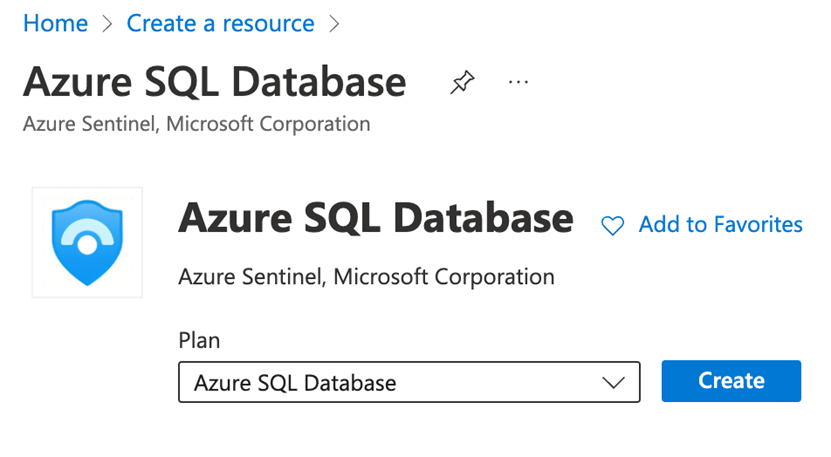
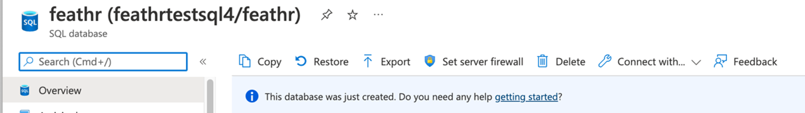

# Creating the BACPAC file

BACPAC is the SQL server backup format, the BACPAC file we used in the ARM template contains empty tables with predefined schemas, which are required by the registry service. 

In case you need to re-create the BACPAC file, follow these steps: 

1. Create a new, empty SQL database on Azure 

2. Connect to the database with a SQL client, such as Azure Data Studio, run the SQL script at https://github.com/feathr-ai/feathr/blob/main/registry/sql-registry/scripts/schema.sql 

3. Now we created the tables required by the registry service, we can use “Export” function to create the BACPAC file 

After this step, the database is not needed anymore. 