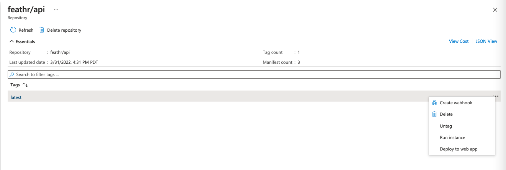
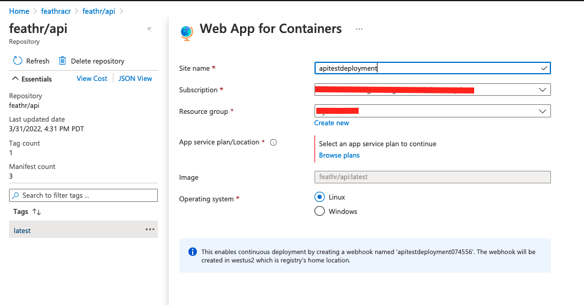
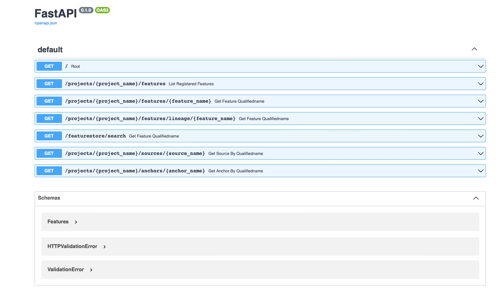

# Feathr REST API

The REST API currently supports following functionalities:

1. Get Feature by Qualified Name
2. Get Feature by GUID
3. Get List of Features
4. Get Lineage for a Feature

## Build and run locally

### Install

**NOTE:** You can run the following command in your local python environment or in your Azure Virtual machine.
You can install dependencies through the requirements file

```bash
pip install -r requirements.txt
```

### Run

This command will start the uvicorn server locally and will dynamically load your changes.

```bash
uvicorn api:app --port 8080 --reload
```

## Build and deploy on Azure

Here are the steps to build the API as a docker container, push it to Azure Container registry and then deploy it as webapp. The instructions below are for Mac/Linux but should work on Windows too. You might have to use sudo command or run docker as administrator on windows if you don't have right privileges.

1.  Install Azure CLI by following instructions [here](https://docs.microsoft.com/en-us/cli/azure/install-azure-cli?view=azure-cli-latest)

1.  Create Azure Container Registry. First create the resource group.

    ```bash
    az group create --name <your_rg_name> --location <location example:westus>
    ```

    Then create the container registry

    ```bash
    az acr create --resource-group <your_rg_name> --name <registry-name> --sku Basic
    ```

1.  Login to your Azure container registry (ACR) account.

    ```bash
    $ az acr login --name <registry-name>
    ```

1.  Clone the repository and navigate to api folder

    ```bash
    $ git clone git@github.com:linkedin/feathr.git

    $ cd feathr_project/feathr/api

    ```

1.  Build the docker container locally, you need to have docker installed locally and have it running. To set up docker on your machine follow the instructions [here](https://docs.docker.com/get-started/)  
    **Note: Note: <your_username>/image_name is not a mandatory format for specifying the name of the image.It’s just a useful convention to avoid tagging your image again when you need to push it to a registry. It can be anything you want in the format below**

        ```bash
        $ docker build -t feathr/api .
        ```

1.  Run docker images command and you will see your newly created image

    ```bash
    $ docker images

        REPOSITORY   TAG       IMAGE ID       CREATED         SIZE
        feathr/api   latest    a647ea749b9b   5 minutes ago   529MB
    ```

1.  Before you can push an image to your registry, you must tag it with the fully qualified name of your ACR login server. The login server name is in the format <registry-name>.azurecr.io (all lowercase), for example, mycontainerregistry007.azurecr.io. Tag the image
    ```bash
    $ docker tag feathr/api:latest feathracr.azurecr.io/feathr/api:latest
    ```
1.  Push the image to the registry
    ```bash
    $ docker push feathracr.azurecr.io/feathr/api:latest
    ```
1.  List the images from your registry to see your recently pushed image
    ```
    az acr repository list --name feathracr --output table
    ```
    Output:
    ```
    Result
    ----------
    feathr/api
    ```

## Deploy image to Azure WebApp for Containers

1. Go to [Azure portal](https://portal.azure.com) and search for your container registry
1. Select repositories from the left pane and click latest tag. Click on the three dots on right side of the tag and select **Deploy to WebApp** option. If you see the **Deploy to WebApp** option greyed out, you would have to enable Admin User on the registry by Updating it.

   

   

1. Provide a name for the deployed webapp, along with the subscription to deploy app into, the resource group and the appservice plan

   

1. You will get the notification that your app has been successfully deployed, click on **Go to Resource** button.

1. On the App overview page go to the URL (https://<app_name>.azurewebsites.net/docs) for deployed app (it's under URL on the app overview page) and you should see the API documentation.

   

Congratulations you have successfully deployed the Feathr API.
