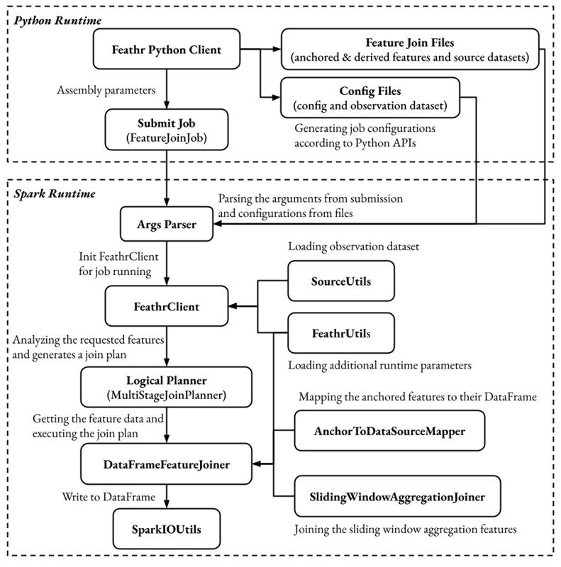
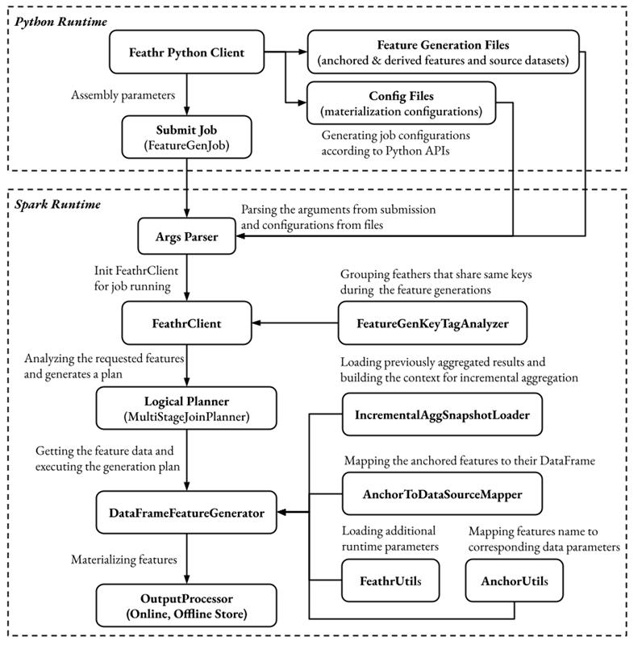

# Feathr Code Structure

## Code Structure for get_offline_features() and materialize_features() API calls

Credit goes to @csruiliu for creating those diagrams below:

### Feathr get_offline_features() diagram

### Feathr materialize_features() diagram

