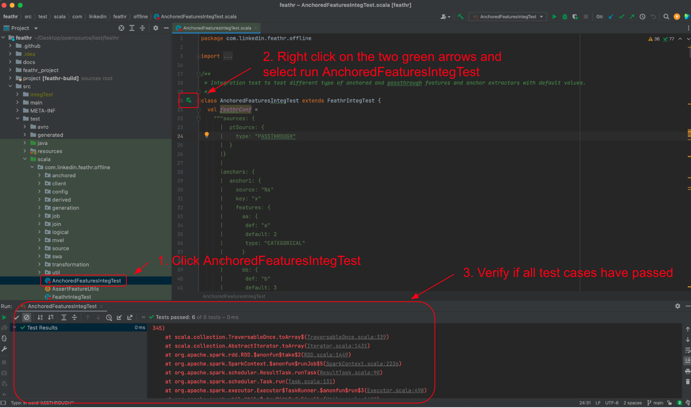

# Feathr Scala Project Developer Guide

## IntelliJ Setup

IntelliJ is the recommended IDE to use when developing Feathr. Please visit IntelliJ's 
[installation guide](https://www.jetbrains.com/help/idea/installation-guide.html) to install it
in your local machine. To import Feathr as a new project:
1. Git clone Feathr into your local machine. i.e. via https `git clone https://github.com/linkedin/feathr.git` or ssh `git clone git@github.com:linkedin/feathr.git`
2. In IntelliJ, select `File` > `Project from Existing Sources...` and select `feathr` from the directory you cloned.
3. Under `Import project from external model` select `sbt`. Click `Next`.
4. Under `Project JDK` specify a valid Java `1.8` JDK and select SBT shell for `project reload` and `builds`.
5. Click `Finish`.
6. You should see something like `[success] Total time: 5 s, completed Jun 1, 2022 9:43:26 PM` in sbt shell.

### Setup Verification

After waiting for IntelliJ to index, verify your setup by running a test suite in IntelliJ.

1. Search for and open a random test, i.e. here we will go with `AnchoredFeaturesIntegTest` as shown in the IntelliJ screenshot below.
2. Next to the class declaration, right click on the two green arrows and select `Run 'AnchoredFeaturesIntegTest'`. It could be any test case.
3. Verify if all test cases have passed.



## Scala Coding Style Guide

Please checkout [Databricks' Scala Style Guide](https://github.com/databricks/scala-style-guide) or the official [Scala Style Guide](https://docs.scala-lang.org/style/?fbclid=IwAR18Pl_IZmWJUrlNlyzJmwNAniaWe_S3maTgF-dQCbY6jqLufsIJKI-syf8).

## Building and Testing

Feathr is compiled using [SBT](https://www.scala-sbt.org/1.x/docs/Command-Line-Reference.html).

To compile, run
```
sbt compile
```

To execute tests, run
```
sbt test
```

To execute a single test suite, run
```
sbt 'testOnly com.linkedin.feathr.offline.AnchoredFeaturesIntegTest'
```

Refer to [SBT docs](https://www.scala-sbt.org/1.x/docs/Command-Line-Reference.html) for more commands.