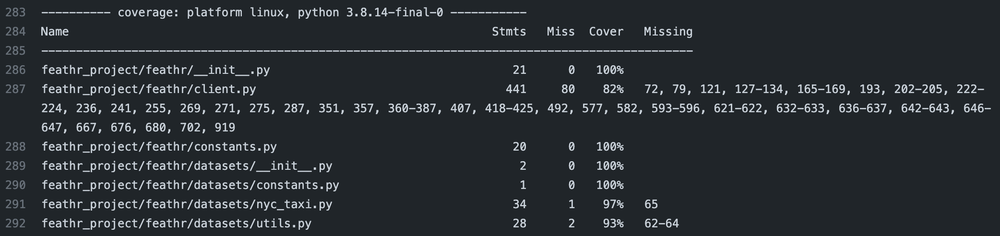

# Feathr Test Coverage Check Guide

## Background
To maintain and improve codes quality of feathr, we expect test coverage ratio to be equal to or above 90% in general. For any code changes, please make sure related test cases are added and check that test coverage can meet our request.

## How to conduct test coverage
### Through github workflows pipeline:
   We already added this coverage checking into our CI pipeline. For every pull request, push and scheduled jobs, github will check the coverage when runing 'pytest' automatically. You can find the result for 'azure_synapse', 'databricks' and 'local spark', respectively from each PR and commit.

   An example of test coverage result:


   From the example above we can see the result can show coverage ratio for each file and also the missing lines of codes that current test cases fail to cover. Based on the result, we can add related test cases to improve the total test coverage ratio.

### Test locally:
   We can also check the coverage locally by simply running the command under `feathr/` directory:
   `pytest --cov-report term-missing --cov=feathr_project/feathr feathr_project/test/`
   This will provide a coverage report for all codes of python client by running all python test cases. 

   You may need to install `pytest-cov` locally:
   `pip install pytest-cov`
   
   If you just want to check coverage situation under some folders by running some of test cases, you can also specify paths for each of them. Eg. if you only want to check coverage ratio of local spark, you may run:
   `pytest --cov-report term-missing --cov=feathr_project/feathr/spark_provider feathr_project/test/test_local_spark_e2e.py`

   In addition, if you want the report ignore some files under the specified folder, you can set it through config file. Eg:
   ```
   [run]
       omit = feathr_project/feathr/registry/_feature_registry_purview.py
       feathr_project/feathr/spark_provider/_synapse_submission.py
       feathr_project/feathr/spark_provider/_localspark_submission.py
   ```

   The default config file is `.coveragerc`. You can also specify one by adding `--cov-config={your_coverage_config}` into the above `pytest` command.

   Coverage config example:
   [coverage config to ignore synapse when running by databricks](../../.github/workflows/.coveragerc_db)

   More reference for pytest coverage:
   [pytest coverage](https://pypi.org/project/pytest-cov/)
   