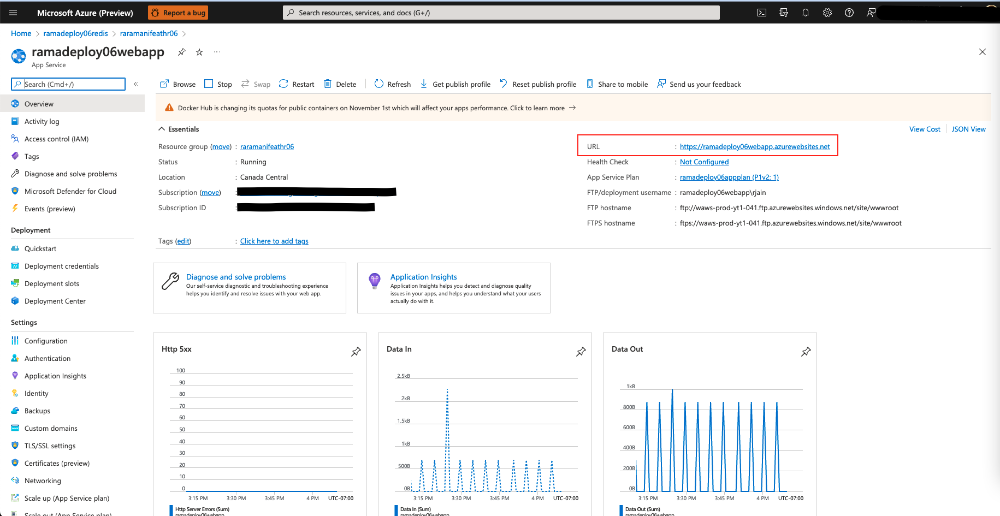
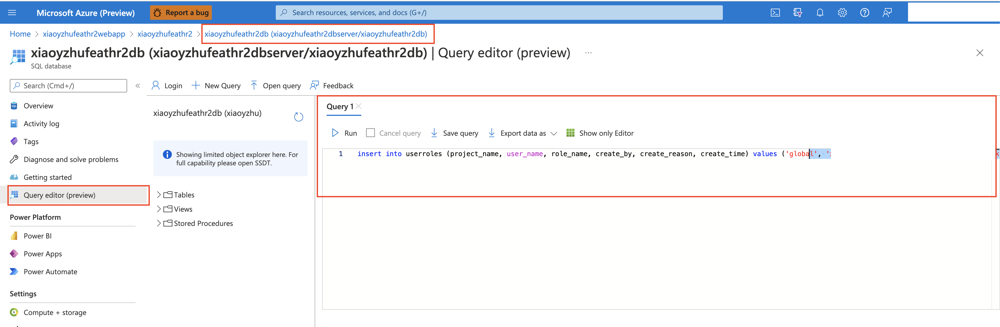

# Azure Resource Provisioning

The provided Azure Resource Manager (ARM) template deploys the following resources, please make sure you have enough quota in the subscription and region you are deploying this in. You can view your quota and make request on Azure [portal](https://ms.portal.azure.com/#view/Microsoft_Azure_Capacity/QuotaMenuBlade/~/overview).

1. Azure Storage account
2. Azure Purview (metadata store if you selected Azure-Purview as registry backend)
3. Azure SQL Server and Database (for RBAC and metadata store if you selected Azure-SQL as registry backend)
4. Azure Synapse workspace and Spark Pool
5. Azure App Service and corresponding App Service plan
6. Azure Key Vault
7. Azure Event Hub
8. Azure Redis

** Please Note: you need to have the *Owner Role* in the resource group you are deploying this in. Owner access is required to assign role to managed identity within the ARM template so it can access key vault and store secrets. It is also required by the permission section in our sample notebooks. If you don't have such permission, you might want to contact your IT admin to see if they can do that. **

Although we recommend end users deploy the resources using the ARM template, we understand that in many situations where users want to reuse existing resources instead of creating new resources; or users may have permission issues. See [Manually connecting existing resources](#manually-connecting-existing-resources) for more details.

## Architecture

The architecture diagram demonstrates how different Azure components interact with each other within Feathr.


## Provision Azure Resources using ARM Template

Feathr has native cloud integration and getting started with Feathr is very straightforward. Here are the instructions:

### 1. Create an Azure Active Directory (AAD) application to enable authentication on the Feathr UI

The very first step is to create an Azure Active Directory (AAD) application to enable authentication on the Feathr UI (which gets created as part of the deployment script). Currently it is not possible to create one through ARM template but you can easily create one by running the following CLI commands in the [Cloud Shell](https://shell.azure.com/bash).

** Please make note of the Client ID and Tenant ID for the AAD app, you will need it in the ARM template deployment section.**

```bash
# This is the prefix you want to name your resources with, make a note of it, you will need it during deployment.
#  Note: please keep the `resourcePrefix` short (less than 15 chars), since some of the Azure resources need the full name to be less than 24 characters. Only lowercase alphanumeric characters are allowed for resource prefix.
resource_prefix="yourprefix"

# Please don't change this name, a corresponding webapp with same name gets created in subsequent steps.
sitename="${resource_prefix}webapp"

# Use the following configuration command to enable dynamic install of az extensions without a prompt. This is required for the az account command group used in the following steps.
az config set extension.use_dynamic_install=yes_without_prompt

# This will create the Azure AD application, note that we need to create an AAD app of platform type Single Page Application(SPA). By default passing the redirect-uris with create command creates an app of type web. Setting Sign in audience to AzureADMyOrg limits the application access to just your tenant.
az ad app create --display-name $sitename --sign-in-audience AzureADMyOrg --web-home-page-url "https://$sitename.azurewebsites.net" --enable-id-token-issuance true
```

After the above step, an AAD application will be created. Note that it will take a few minutes to complete, so make sure the `aad_clientId`, `aad_objectId`, and `aad_tenantId` below are not empty. If they are empty, re-run the three commands to refresh the values for `aad_clientId`, `aad_objectId`, and `aad_tenantId`, as they will be required later.

```bash
# Fetch the ClientId, TenantId and ObjectId for the created app
aad_clientId=$(az ad app list --display-name $sitename --query [].appId -o tsv)

# We just use the homeTenantId since a user could have access to multiple tenants
aad_tenantId=$(az account show --query "[homeTenantId]" -o tsv)

#Fetch the objectId of AAD app to patch it and add redirect URI in next step.
aad_objectId=$(az ad app list --display-name $sitename --query [].id -o tsv)

# Make sure the above command ran successfully and the values are not empty. If they are empty, re-run the above commands as the app creation could take some time.
# MAKE NOTE OF THE CLIENT_ID & TENANT_ID FOR STEP #2
echo "AZURE_AAD_OBJECT_ID: $aad_objectId"
echo "AAD_CLIENT_ID: $aad_clientId"
echo "AZURE_TENANT_ID: $aad_tenantId"

# Updating the SPA app created above, currently there is no CLI support to add redirectUris to a SPA, so we have to patch manually via az rest
az rest --method PATCH --uri "https://graph.microsoft.com/v1.0/applications/$aad_objectId" --headers "Content-Type=application/json" --body "{spa:{redirectUris:['https://$sitename.azurewebsites.net']}}"
```

### 2. Deploy a minimal set of Feathr resources

Click the button below to deploy a minimal set of Feathr resources. This is not for production use as we choose a minimal set of resources, but treat it as a template that you can modify for further use. Note that you should have "Owner" access in your subscription to perform some of the actions.

[](https://portal.azure.com/#create/Microsoft.Template/uri/https%3A%2F%2Fraw.githubusercontent.com%2Ffeathr-ai%2Ffeathr%2Fmain%2Fdocs%2Fhow-to-guides%2Fazure_resource_provision.json)

### 3. Grant Key Vault and Synapse access to selected users (Optional)

You will need to assign the right permission to users in order for them to access Azure key vault, permission to access the Storage Blob as a Contributor, and permission to submit jobs to Synapse cluster. This is useful if you want to allow multiple users access the same environment.

Skip this step if you have already given yourself the access. Otherwise, run the following lines of command in the [Cloud Shell](https://shell.azure.com/bash).

```bash
userId=<email_id_of_account_requesting_access>
resource_prefix=<resource_prefix>
synapse_workspace_name="${resource_prefix}syws"
keyvault_name="${resource_prefix}kv"
objectId=$(az ad user show --id $userId --query id -o tsv)
az keyvault update --name $keyvault_name --enable-rbac-authorization false
az keyvault set-policy -n $keyvault_name --secret-permissions get list --object-id $objectId
az role assignment create --assignee $userId --role "Storage Blob Data Contributor"
az synapse role assignment create --workspace-name $synapse_workspace_name --role "Synapse Contributor" --assignee $userId
```

### 4. Assign the right permission for Azure Purview (Optional)

If you are using Purview registry there is an additional step required for the deployment to work. Registry Server authenticates with Azure Purview using Managed Identity that was created by ARM template. The Managed Identity needs to be added to Azure Purview Collections as a **Data Curator**. For more details, please refer to [Access control in the Microsoft Purview governance portal](https://docs.microsoft.com/en-us/azure/purview/catalog-permissions).


Only collection admins can perform the above operation, the user who created this Purview account is already one. If you want to add additional admins, you can do so by clicking on _Root collection permission_ option on Azure Purview page. The name is usually called `{resource_prefix}identity`.

Congratulations, you have successfully deployed Feathr on Azure. You can access your resources by going to the resource group that you created for the deployment. A good first test would be to access Feathr UI, you can access it by clicking on App Service URL. The URL would have the following format:

```bash
https://{resource_prefix}webapp.azurewebsites.net
```




### 5. Initialize RBAC access table (Optional)

If you want to use RBAC access for your deployment, you also need to manually initialize the user access table. Replace `[your-email-account]` with the email account that you are currently using, and this email will be the global admin for Feathr feature registry.

You need to execute the command below in the database that you have created (see screenshot below). The database is usually something like `{resource_prefix}db`.

```SQL
insert into userroles (project_name, user_name, role_name, create_by, create_reason, create_time) values ('global', '[your-email-account]','admin', '[your-email-account]', 'Initialize First Global Admin',  getutcdate())
```



For more details on RBAC, refer to [Feathr Registry Access Control](../how-to-guides/../concepts/registry-access-control.md) for more details.

## Next Steps

Follow the quick start guide [here](https://feathr-ai.github.io/feathr/quickstart_synapse.html) to try out a notebook example.

## Known Issues/Workaround

1. For SQL Registry backend and RBAC, we create the database using a backup file and it might sometimes time out, [as documented here](https://docs.microsoft.com/en-us/azure/azure-sql/database/database-import-export-hang?view=azuresql). Suggested workaround is to manually run the sql queries to create the table schema for SQL Registry backend and/or RBAC.

   - In Azure Portal, you can directly go to the database that was created as part of the template and click on **Query Editor**.
     This will allow you to run queries directly on the database.
     

   - For credentials, put in the SQL username and password that you passed to the template. You might have to whitelist your IP and add it to the firewall, the screen will prompt you for this if required. Select OK  
     

   - Once the login is successful, you will see the query editor screen. Run the below queries in the editor and create the required schema.
     

   - [SQL Registry DB Schema](https://github.com/feathr-ai/feathr/blob/main/registry/sql-registry/scripts/schema.sql)

   - [RBAC DB Schema](https://github.com/feathr-ai/feathr/blob/main/registry/access_control/scripts/schema.sql)
