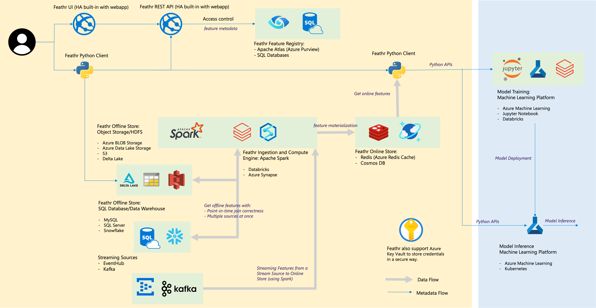
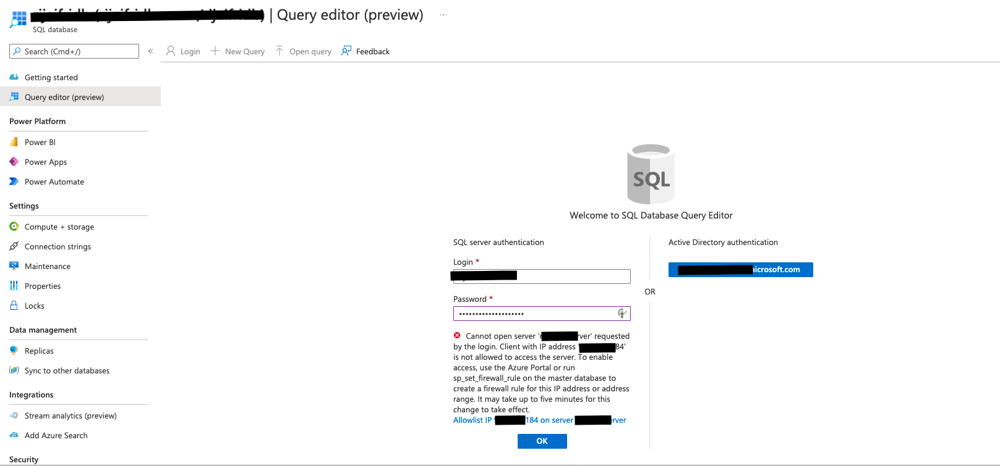

# Azure Resource Provisioning

The provided Azure Resource Manager (ARM) template deploys the following resources, please make sure you have enough quota in the subscription and region you are deploying this in. You can view your quota and make request on Azure [portal](https://ms.portal.azure.com/#view/Microsoft_Azure_Capacity/QuotaMenuBlade/~/overview)
1. Azure Storage account 
2. Azure Purview (metadata store if you selected Azure-Purview as registry backend)
3. Azure SQL Server and Database (for RBAC and metadata store if you selected Azure-SQL as registry backend)
4. Azure Synapse workspace and Spark Pool
5. Azure App Service and corresponding App Service plan
6. Azure Key Vault
7. Azure Event Hub
8. Azure Redis

Please note, you need to have __owner access__ in the resource group you are deploying this in. Owner access is required to assign role to managed identity within ARM template so it can access key vault and store secrets.

## Architecture
The architecture diagram demonstrates how different Azure components interact with each other within Feathr.


## Provision Azure Resources using ARM Template

Feathr has native cloud integration and getting started with Feathr is very straightforward. Here are the instructions:

1. The very first step is to create an Azure Active Directory (AAD) application to enable authentication on the Feathr UI (which gets created as part of the deployment script). Currently it is not possible to create one through ARM template but you can easily create one by running the following CLI commands in the [Cloud Shell](https://shell.azure.com/bash)

    ```bash
    # This is the prefix you want to name your resources with, make a note of it, you will need it during deployment.
    #  Note: please keep the `resourcePrefix` short (less than 15 chars), since some of the Azure resources need the full name to be less than 24 characters. Only lowercase alphanumeric characters are allowed for resource prefix.
    prefix="userprefix1" 

    # Please don't change this name, a corresponding webapp with same name gets created in subsequent steps.
    sitename="${prefix}webapp" 

    # Use the following configuration command to enable dynamic install of az extensions without a prompt
    az config set extension.use_dynamic_install=yes_without_prompt 
    # This will create the Azure AD application, note that we need to create an AAD app of platform type Single Page Application(SPA). By default passing the redirect-uris with create command creates an app of type web. Setting Sign in audience to AzureADMyOrg limits the application access to just your tenant.
    az ad app create --display-name $sitename --sign-in-audience AzureADMyOrg --web-home-page-url "https://$sitename.azurewebsites.net" --enable-id-token-issuance true

    # Fetch the ClientId, TenantId and ObjectId for the created app
    aad_clientId=$(az ad app list --display-name $sitename --query [].appId -o tsv)

    # We just use the homeTenantId since a user could have access to multiple tenants
    aad_tenantId=$(az account  show --query "[homeTenantId]" -o tsv)

    #Fetch the objectId of AAD app to patch it and add redirect URI in next step.
    aad_objectId=$(az ad app list --display-name $sitename --query [].id -o tsv)

    # Make sure the above command ran successfully and it should not be empty.
    echo "AZURE_AAD_OBJECT_ID: $aad_objectId"

    # Updating the SPA app created above, currently there is no CLI support to add redirectUris to a SPA, so we have to patch manually via az rest
    az rest --method PATCH --uri "https://graph.microsoft.com/v1.0/applications/$aad_objectId" --headers "Content-Type=application/json" --body "{spa:{redirectUris:['https://$sitename.azurewebsites.net']}}"

    # Make a note of the ClientId and TenantId, you will need it during deployment.
    echo "AAD_CLIENT_ID: $aad_clientId"
    echo "AZURE_TENANT_ID: $aad_tenantId"
    ``` 

2. Click the button below to deploy a minimal set of Feathr resources. This is not for production use as we choose a minimal set of resources, but treat it as a template that you can modify for further use. Note that you should have "Owner" access in your subscription to perform some of the actions.

[](https://portal.azure.com/#create/Microsoft.Template/uri/https%3A%2F%2Fraw.githubusercontent.com%2Flinkedin%2Ffeathr%2Fmain%2Fdocs%2Fhow-to-guides%2Fazure_resource_provision.json)

Known Issues/Workaround
1. For SQL Resitry backend and RBAC, we create the database using a backup file and it might sometimes time out, [as documented here](https://docs.microsoft.com/en-us/azure/azure-sql/database/database-import-export-hang?view=azuresql).  Suggested workaround is to manually run the sql queries to create the table schema for SQL Registry backend and/or RBAC.

    - In Azure Portal, you can directly go to the database that was created as part of the template and click on __Query Editor__. 
    This will allow you to run queries directly on the database. 
    

    - The next screen will ask for credentials, put in the SQL username and password that you passed to the template. You might have to whitelist your IP and add it to the firewall, the screen will prompt you for this if required.    
    

    - Run the below queries in the editor and create the rquired schema.
        
        - [SQL Registry DB Schema](https://github.com/linkedin/feathr/blob/main/registry/sql-registry/scripts/schema.sql)

        - [RBAC DB Schema](https://github.com/linkedin/feathr/blob/main/registry/access_control/scripts/schema.sql)


