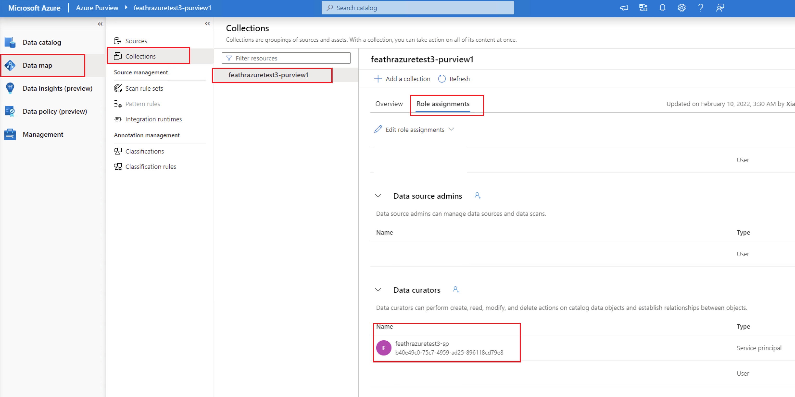

# Azure Resource Provisioning

Due to the complexity of the possible cloud environment, it is almost impossible to create a script that works for all the cloud setup use cases. Because of this, users are expected to:

## Running Feathr with only a few clicks

Feathr has native cloud integration and getting started with Feathr is very straightforward. You only need three steps:

1. Get the principal ID of your account by running `az ad signed-in-user show --query objectId -o tsv` in the link below (Select "Bash" if you are asked to choose one), and write down that value (will be something like `b65ef2e0-42b8-44a7-9b55-abbccddeefff`)


[](https://shell.azure.com/bash)

2. Click the button below to deploy a minimal set of Feathr resources. This is not for production use as we choose a minimal set of resources, but treat it as a template that you can modify for further use. Note that you should have "Owner" access in your subscription to perform some of the actions.

[](https://portal.azure.com/#create/Microsoft.Template/uri/https%3A%2F%2Fraw.githubusercontent.com%2Flinkedin%2Ffeathr%2Fmain%2Fdocs%2Fhow-to-guides%2Fazure_resource_provision.json)


## Note on the Template above

The above way will work if you have owner access to some of the resources. [According to the Azure Documentation](https://docs.microsoft.com/en-us/azure/role-based-access-control/built-in-roles#all), only the "Owner" role of a subscription will have permissions to assign roles in Azure RBAC, which is used in the above Azure Template.

However, if you don't have Owner permission in your subscription, you can ask your IT team to run the above template for you and give you the permissions for those resources; Or you can use the way described below, provision a service principal to access all the resources.


## Provision Azure Resources with Service Principals

1. Use the content below as a detailed explanation of [Azure resource provisioning script](./azure_resource_provision.sh). **DO NOT** run that script directly given the complexity of cloud environment setup. Instead, follow the steps in this documentation so you can always go back and check your step in case of some failures.
2. We provide an [Azure resource provisioning script](./azure_resource_provision.sh) which can be used to automate the process
3. Make sure you have sufficient permission for creating resources or add roles.
4. Tailor this script based on the IT setup in your specific environment.

## Prerequesities

This documentation assumes users have some basic knowledge of Azure. More specifically, users should:

- [Have Azure-CLI installed](https://aka.ms/azure-cli)
- Know where to get your Azure subscription ID. If you don't, you should probably consult your IT admin, or someone in your team who used Azure before. Usually a subscription is shared across a department (such as one subscription for an application team and another subscription for an infrastructure team).

## Cost of the setup

The cost of this demo setup should be minimal, given that all the resources used in this guide are either configured as automatically deleted (such as Synpase Spark cluster), pay-as-you-go (like Azure Storage), or with small scale (like Redis cluster).

## Architecture

In this setup, we will setup the following account:

- Azure storage account (with Azure Data Lake Gen2) for offline store
- Azure Synapse Spark, for feature processing and to run Feathr runtime
- Azure Redis Cache for online store
- Azure Purview for feature registry (optional)

A more comprehensive setup is as below:


## Name setup

Put in the name and password you want to use in the sections below. You can get the subscription ID and the location from your IT admins, and set all the other names based on your preference.

Note: please keep the `resource_prefix` short, since some of the Azure resources need the full name to be less than 24 characters. It's recommended that to keep `resource_prefix` less than 15 characters.

```bash
subscription_id="{your_subscription_id}"
resource_prefix="feathrazuretest"
location="eastus2"
synapse_sql_admin_name="cliuser1"
synapse_sql_admin_password="{your_admin_password}"
synapse_sparkpool_name="spark31"
```

## Login to Azure and set the corresponding subscription you want to work on

Please make sure you have the latest Azure CLI installed. You can do so by executing:

```bash
az upgrade --all true --yes
```

If you haven't installed Azure CLI, follow the steps in this page to install Azure CLI:
(https://aka.ms/azure-cli)[https://aka.ms/azure-cli]

```bash
if ! [ -x "$(command -v az)" ]; then
  echo 'Error: Azure CLI is not installed. Please follow guidance on https://aka.ms/azure-cli to install az command line' >&2
  exit 1
fi

# login if required
az account get-access-token
if [[ $? == 0 ]]; then
  echo "Logged in, using current subscriptions "
else
  echo "Logging in via az login..."
  az login
fi
```

# Setup all the resource names

Setup all the resource names which will be used later.

```bash
service_principal_name="$resource_prefix-sp"
resoruce_group_name="$resource_prefix-rg"
storage_account_name="$resource_prefix"sto
storage_file_system_name="$resource_prefix"fs
synapse_workspace_name="$resource_prefix"spark
redis_cluster_name="$resource_prefix"redis
purview_account_name="$resource_prefix-purview"
```

And then set the current subscription ID:

```bash
az account set -s $subscription_id
```

# Create a Service Principal which you can automate later

You can simply think an Azure Service Principal is an account that can be used for automation (so you don't have to use your own account to perform all the actions), though it can do much more than that. We will use a service principal for the steps below, but you can also use your own Azure account for all those actions as long as you have sufficient permission.

```bash
sp_password=$(az ad sp create-for-rbac --name $service_principal_name --role Contributor --query "[password]"  --output tsv)
sp_objectid=$(az ad sp list --display-name $service_principal_name --query "[].{objectId:objectId}" --output tsv)
sp_appid=$(az ad sp list --display-name $service_principal_name --query "[].{appId:appId}" --output tsv)
sp_tenantid=$(az ad sp list --display-name $service_principal_name --query "[].{appOwnerTenantId:appOwnerTenantId}" --output tsv)
echo "AZURE_CLIENT_ID: $sp_appid"
echo "AZURE_TENANT_ID: $sp_tenantid"
echo "AZURE_CLIENT_SECRET: $sp_password"
```

This will give three variables: `AZURE_CLIENT_ID`, `AZURE_TENANT_ID` and `AZURE_CLIENT_SECRET`. You will need them later.

**You should save `AZURE_CLIENT_SECRET` because you will only see it once here**

## Create a resource group to group all the resources that will be used later

```bash
az group create -l $location -n $resoruce_group_name
```

## Create a storage account

Next, we need to:

- create an Azure Storage Account with Azure Data Lake Gen2 enabled
- create a default container
- assign the Service Principal we just created to the `Storage Blob Data Contributor` role to this storage account, so it can upload and download files accordingly.

```bash
az storage account create --name $storage_account_name  --resource-group $resoruce_group_name --location $location --enable-hierarchical-namespace

az storage fs create -n $storage_file_system_name --account-name $storage_account_name

az role assignment create --role "Storage Blob Data Contributor" --assignee "$sp_objectid" --scope "/subscriptions/$subscription_id/resourceGroups/$resoruce_group_name/providers/Microsoft.Storage/storageAccounts/$storage_account_name"
```

## Create a Synapse cluster:

Next, we need to create an Azure Synapse Workspace. You can learn more about Azure Synapse in the [documentation page](https://azure.microsoft.com/en-us/services/synapse-analytics/). In a nutshell, in a Synapse Workspace, you can get a managed Apache Spark Pool which you can stop at anytime, as well as an enterprise datawarehouse.

The script below helps you to:

- Create a Synapse Workspace
- Create a Synapse Spark Pool
- Assign the right permssion to this Spark Pool

```bash
# Create Synapse Cluster
az synapse workspace create --name $synapse_workspace_name --resource-group $resoruce_group_name  --storage-account $storage_account_name --file-system $storage_file_system_name --sql-admin-login-user $synapse_sql_admin_name --sql-admin-login-password $synapse_sql_admin_password --location $location

az synapse spark pool create --name $synapse_sparkpool_name --workspace-name $synapse_workspace_name  --resource-group $resoruce_group_name --spark-version 2.4 --node-count 3 --node-size Medium --enable-auto-pause true --delay 30

# depending on your preference, you can set a narrow range of IPs (like below) or a broad range of IPs to allow client access to Synapse clusters
external_ip=$(curl -s http://whatismyip.akamai.com/)
echo "External IP is: ${external_ip}. Adding it to firewall rules"
az synapse workspace firewall-rule create --name allowAll --workspace-name $synapse_workspace_name --resource-group $resoruce_group_name --start-ip-address "$external_ip" --end-ip-address "$external_ip"

# sleep for a few seconds for the chagne to take effect
sleep 2
az synapse role assignment create --workspace-name $synapse_workspace_name --role "Synapse Contributor" --assignee $service_principal_name


```

Alternatively, you can use your Azure account ("User Principal Name") like below:

```bash
az synapse role assignment create --workspace-name $synapse_workspace_name --role "Synapse Contributor" --assignee  "username@contoso.com"
```

Optional: You can verify if the role assignment is successful or not: (it will list the roles like below):

```bash
echo "Verify if the assignment is successful or not:"
az synapse role assignment list --workspace-name $synapse_workspace_name  --assignee $service_principal_name
```

```json
{
  "id": "c113807f-057a-403f-9b61-192b680e0e07",
  "principalId": "3e5dcd0c-5fd1-4600-adf8-0dde3abd3ea1",
  "principalType": "ServicePrincipal",
  "roleDefinitionId": "7572bffe-f453-4b66-912a-46cc5ef38fda",
  "scope": "workspaces/feathrtestsynapse"
}
```

## Configurure Redis Cluster

We will use Redis as on online store. Below is the command to create Redis with Basic SKU and with a small VM size for demo purpose.

This config is only for demo purpose. For production scenario, you should consider:

- using a Premium SKU with larger VM
- enable multiple zones
- use more replicas
  Please refer to the article [Enable zone redundancy for Azure Cache for Redis](https://docs.microsoft.com/en-us/azure/azure-cache-for-redis/cache-how-to-zone-redundancy) for more information on enabling zone redundency.

You should also record the password which will be used later.

```bash
echo "Creating Redis Cluster..."
az redis create --location $location --name $redis_cluster_name --resource-group $resoruce_group_name  --sku Basic --vm-size c0 --redis-version 6

# Alternatively for production setting you can use the template below:

# az redis create --location $location --name $redis_cluster_name --resource-group $resoruce_group_name  --sku Premium --vm-size p5 --redis-version 6 --replicas-per-master 3 --zones 1 2 3

echo "Record this Redis Key which you will use later:"
redis_password=$(az redis list-keys --name $redis_cluster_name --resource-group $resoruce_group_name  --query "[primaryKey]" --out tsv)
echo "REDIS_PASSWORD: $redis_password"
```

## Configure Purview Account (optional)

[Azure Purview](https://azure.microsoft.com/en-us/services/purview/) will be used here for feature registry and feature sharing. The code below will create a Purview Account.

```bash
echo "creating purview account"
az extension add --name purview
az purview account create --location $location --account-name $purview_account_name --resource-group $resoruce_group_name
```

You should also grant the service principal the `Data Curator` to your Purview collection manually. For more details, please refer to [Access control in Azure Purview documentation](https://docs.microsoft.com/en-us/azure/purview/catalog-permissions)



## Upload demo data

This is completely optional. It will download NYC Taxi Driver data and upload it to the default storage account, to make the setup experience smoother.

See more details on the raw dataset from the [TLC Trip Record Data webpage](https://www1.nyc.gov/site/tlc/about/tlc-trip-record-data.page):

```bash
echo "preparing demo data"
wget -O /tmp/green_tripdata_2020-04.csv https://s3.amazonaws.com/nyc-tlc/trip+data/green_tripdata_2020-04.csv
az storage fs file upload --account-name $storage_account_name --file-system $storage_file_system_name --path demo_data/green_tripdata_2020-04.csv --source /tmp/green_tripdata_2020-04.csv --auth-mode account-key
```

## Deleting all resources (Optional)

You can optionally delete all the resources based on the policy of your organization, like below:

```bash
az group delete -n $resoruce_group_name --yes
az ad sp delete --id $sp_objectid
```
