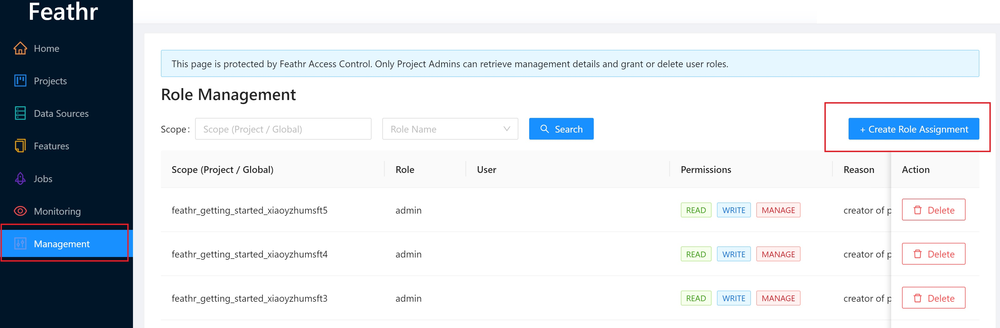

# Advanced Usage on Feathr

This document describes various advanced usages on Feathr

# Adding Additional Users to your Feathr environment

They are all optional steps are are for reference only. Some of the steps are optional if you are not using those services (such as Synapse)

1. Update the key vault permission as well as the Synapse cluster permission:

```bash
userId=<email_id_of_account_requesting_access>
resource_prefix=<resource_prefix>
synapse_workspace_name="${resource_prefix}syws"
keyvault_name="${resource_prefix}kv"
objectId=$(az ad user show --id $userId --query id -o tsv)
az keyvault update --name $keyvault_name --enable-rbac-authorization false
az keyvault set-policy -n $keyvault_name --secret-permissions get list --object-id $objectId
az role assignment create --assignee $userId --role "Storage Blob Data Contributor"
az synapse role assignment create --workspace-name $synapse_workspace_name --role "Synapse Contributor" --assignee $userId
```

2. Grant users access control in the Feathr UI by going to the "management" page, as below shows:

