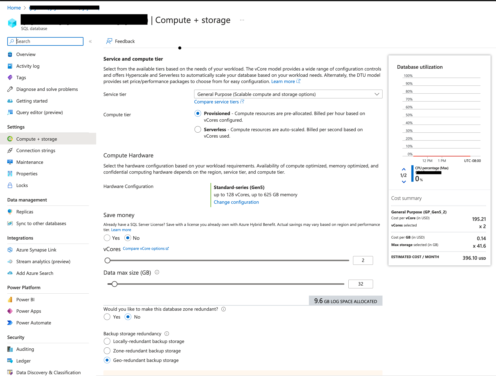
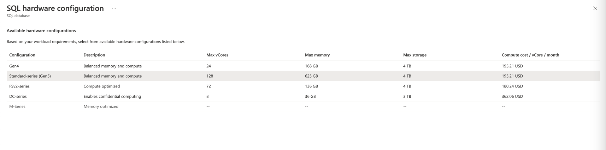
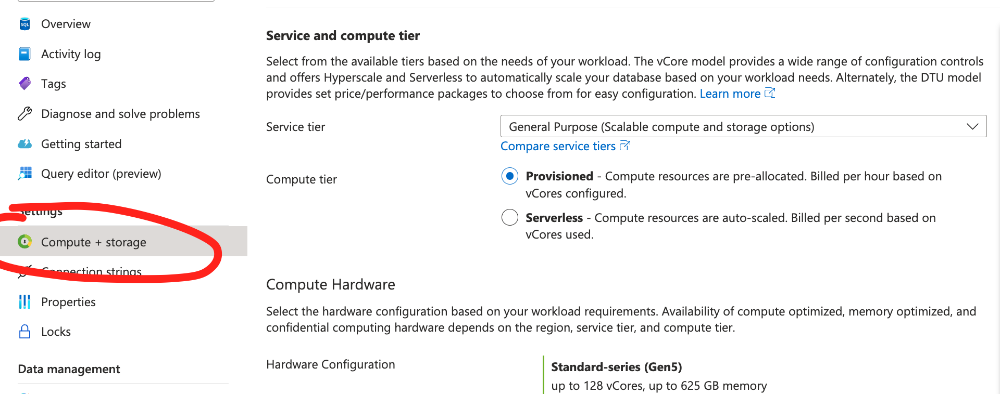

# Azure SQL DB with Feathr

Feathr supports using SQL databases as source or offline store, it also supports using Azure SQL DB as metadata store (registry backend). Feathr's RBAC is also supported by the same SQL DB. 

There are many different storage and compute options when creating an Azure SQL Database, and an optimal configuration depends on your specific use case. When picking a default configuration as part of the deployment template we sticked to the default configuration provided by SQL DB team as it is more balanced and covers most of the use cases. Here is the configuration of SQL DB provisioned as part of feathr deployment template

To pick a different service tier or compute tier based on your specific scenario, please refer to this detailed [documentation](https://learn.microsoft.com/en-us/azure/azure-sql/database/purchasing-models?view=azuresql).

Similary you can pick a different hardware configuration, here are the available hardware configurations. Note that this might be different depending on the azure region you are in.

## Modify ARM template to create a different SKU
We don't provide a SKU for Azure SQL DB ARM template as part of our deployment, as a result the default sku is picked. If you want to modify the ARM template to provide a different SKU, [here](https://learn.microsoft.com/en-us/azure/templates/microsoft.sql/servers/databases?pivots=deployment-language-arm-template#resource-format-1) is how you can do it.

You can also do the same from Azure Portal, by selecting the database and clicking on the __Compute+Storage__ option on the left.

## Summary
The default Azure SQL DB should be good enough for most use cases. For advance scenarios you can follow the above recommendation/resources to choose the best sku combination for the workload.
