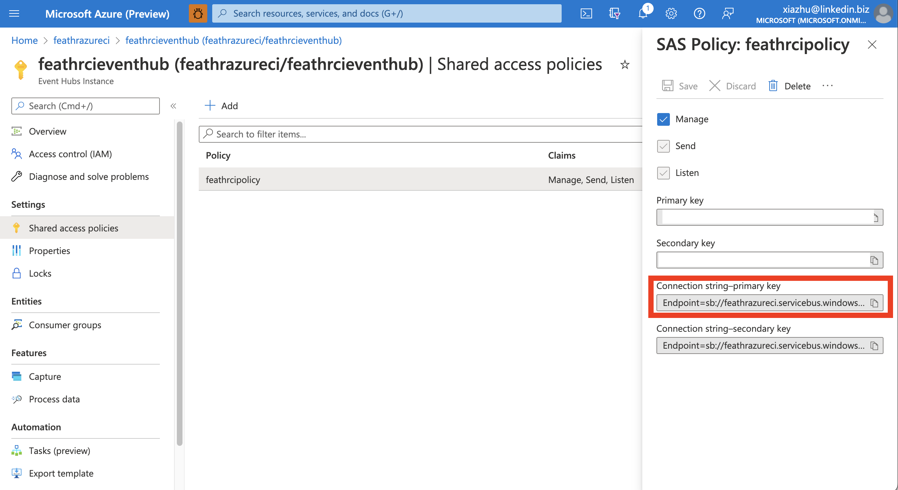

# Configuration and environment variables in Feathr

Feathr uses a YAML file and a few environment variables to allow end users to have more flexibility. See the example of the following configurations in [this file](https://github.com/feathr-ai/feathr/blob/main/feathr_project/feathrcli/data/feathr_user_workspace/feathr_config.yaml).

In that YAML file, it contains the configurations that are used by Feathr. All the configurations can be overwritten by environment variables with concatenation of `__` for different layers of this config file. For example, `feathr_runtime_location` for databricks can be overwritten by setting this environment variable: `SPARK_CONFIG__DATABRICKS__FEATHR_RUNTIME_LOCATION`. For example, you can set it in python:

```python
os.environ['SPARK_CONFIG__DATABRICKS__FEATHR_RUNTIME_LOCATION'] = "https://azurefeathrstorage.blob.core.windows.net/public/feathr-assembly-LATEST.jar"
```

or in shell environment:

```bash
export SPARK_CONFIG__DATABRICKS__FEATHR_RUNTIME_LOCATION=https://azurefeathrstorage.blob.core.windows.net/public/feathr-assembly-LATEST.jar
```

This allows end users to store the configuration in a secure way, say in Kubernetes secrets, key vault, etc. All the configurations available for end users to configure are listed below.

# Default behaviors

Feathr will get the configurations in the following order:

1. If the key is set in the environment variable, Feathr will use the value of that environment variable
2. If it's not set in the environment, then a value is retrieved from the `feathr_config.yaml` file with the same config key.
3. If it's not available in the `feathr_config.yaml` file, Feathr will try to retrieve the value from a key vault service. Currently both Azure Key Vault and AWS Secrets Manager are supported.

# Using Secret Management Service in Feathr

Feathr supports using a Secret Management service for all the credentials and environment variables. Currently the supported secret management services are Azure Key Vault and AWS Secrets Manager. 

In order to use those secret management service, there are two steps:

Step 1: Tell Feathr which secret management service to use, and what is the corresponding namespace.

If using Azure Key Vault:
```yaml
secrets:
  azure_key_vault:
    name: feathrazuretest3-kv
```

If using AWS Secret Manager, users should put the corresponding secret_id in the `feathr_config.yaml` section, like below, so that Feathr knows which secret_id to use to retrieve the required credentials.
```yaml
secrets:
  aws_secrets_manager:
    secret_id: feathrsecret_namespace
```

Step 2: Initialize a secret management client and pass it to Feathr.

For Azure Key Vault:
```python
from azure.keyvault.secrets import SecretClient
secret_client = SecretClient(
                vault_url = f"https://<replace_with_key_vault_name>.vault.azure.net",
                credential=DefaultAzureCredential()
            )
feathr_client = FeathrClient(..., secret_manager_client = secret_client)
```

For AWS Secrets Manager, users need to create a SecretCache object and pass it to Feathr client, like below:
```python
import botocore 
import botocore.session 
from aws_secretsmanager_caching import SecretCache, SecretCacheConfig 

client = botocore.session.get_session().create_client(
    service_name='secretsmanager',
    aws_access_key_id = '<replace_your_aws_access_key_id>',
    aws_secret_access_key= '<replace_your_aws_secret_access_key>',
    region_name=region_name
)
cache_config = SecretCacheConfig()
cache = SecretCache( config = cache_config, client = client)
feathr_client = FeathrClient(..., secret_manager_client = cache)

```

# A list of environment variables that Feathr uses

| Environment Variable                                                    | Description                                                                                                                                                                                                                                                | Required?                                                                                                               |
| ----------------------------------------------------------------------- | ---------------------------------------------------------------------------------------------------------------------------------------------------------------------------------------------------------------------------------------------------------- | ----------------------------------------------------------------------------------------------------------------------- |
| SECRETS__AZURE_KEY_VAULT__NAME                                          | Name of the Azure Key Vault service so that Feathr can get credentials from that service.                                                                                                                                                                  | Optional                                                                                                                |
| AZURE_CLIENT_ID                                                         | Client ID for authentication into Azure Services. Read [here](https://docs.microsoft.com/en-us/python/api/azure-identity/azure.identity.environmentcredential?view=azure-python) for more details.                                                         | This is required if you are using Service Principal to login with Feathr.                                               |
| AZURE_TENANT_ID                                                         | Tenant ID for authentication into Azure Services. Read [here](https://docs.microsoft.com/en-us/python/api/azure-identity/azure.identity.environmentcredential?view=azure-python) for more details.                                                         | This is required if you are using Service Principal to login with Feathr.                                               |
| AZURE_CLIENT_SECRET                                                     | Client secret for authentication into Azure Services. Read [here](https://docs.microsoft.com/en-us/python/api/azure-identity/azure.identity.environmentcredential?view=azure-python) for more details.                                                         | This is required if you are using Service Principal to login with Feathr.                                               |
| OFFLINE_STORE__ADLS__ADLS_ENABLED                                       | Whether to enable ADLS as offline store or not. Available value: "True" or "False". Equivalent to "False" if not set.                                                                                                                                      | Optional                                                                                                                |
| ADLS_ACCOUNT                                                            | ADLS account that you connect to.                                                                                                                                                                                                                          | Required if using ADLS as an offline store.                                                                             |
| ADLS_KEY                                                                | ADLS key that you connect to.                                                                                                                                                                                                                              | Required if using ADLS as an offline store.                                                                             |
| OFFLINE_STORE__WASB__WASB_ENABLED                                       | Whether to enable Azure BLOB storage as offline store or not. Available value: "True" or "False". Equivalent to "False" if not set.                                                                                                                        |
| BLOB_ACCOUNT                                                            | Azure BLOB Storage account that you connect to.                                                                                                                                                                                                            | Required if using Azure BLOB Storage as an offline store.                                                               |
| BLOB_KEY                                                                | Azure BLOB Storage key that you connect to.                                                                                                                                                                                                                | Required if using Azure BLOB Storage as an offline store.                                                               |
| S3_ACCESS_KEY                                                           | AWS S3 access key for the S3 account.                                                                                                                                                                                                                      | Required if using AWS S3 Storage as an offline store.                                                                   |
| S3_SECRET_KEY                                                           | AWS S3 secret key for the S3 account.                                                                                                                                                                                                                      | Required if using AWS S3 Storage as an offline store.                                                                   |
| OFFLINE_STORE__S3__S3_ENABLED                                           | Whether to enable S3 as offline store or not. Available value: "True" or "False". Equivalent to "False" if not set.                                                                                                                                        | Optional                                                                                                                |
| OFFLINE_STORE__S3__S3_ENDPOINT                                          | S3 endpoint. If you use S3 endpoint, then you need to provide access key and secret key in the environment variable as well.                                                                                                                               | Required if using AWS S3 Storage as an offline store.                                                                   |
| OFFLINE_STORE__JDBC__JDBC_ENABLED                                       | Whether to enable JDBC as offline store or not. Available value: "True" or "False". Equivalent to "False" if not set.                                                                                                                                      | Optional                                                                                                                |
| OFFLINE_STORE__JDBC__JDBC_DATABASE                                      | If using JDBC endpoint as offline store, this config specifies the JDBC database to read from.                                                                                                                                                             | Required if using JDBC sources as offline store                                                                         |
| OFFLINE_STORE__JDBC__JDBC_TABLE                                         | If using JDBC endpoint as offline store, this config specifies the JDBC table to read from. Same as `JDBC_TABLE`.                                                                                                                                          | Required if using JDBC sources as offline store                                                                         |
| JDBC_TABLE                                                              | If using JDBC endpoint as offline store, this config specifies the JDBC table to read from                                                                                                                                                                 | Required if using JDBC sources as offline store                                                                         |
| JDBC_USER                                                               | If using JDBC endpoint as offline store, this config specifies the JDBC user                                                                                                                                                                               | Required if using JDBC sources as offline store                                                                         |
| JDBC_PASSWORD                                                           | If using JDBC endpoint as offline store, this config specifies the JDBC password                                                                                                                                                                           | Required if using JDBC sources as offline store                                                                         |
| KAFKA_SASL_JAAS_CONFIG                                                  | see [here](#KAFKA_SASL_JAAS_CONFIG) for more details.                                                                                                                                                                                                      | Required if using Kafka/EventHub as streaming source input.                                                             |
| PROJECT_CONFIG__PROJECT_NAME                                            | Configures the project name.                                                                                                                                                                                                                               | Required                                                                                                                |
| OFFLINE_STORE__SNOWFLAKE__SNOWFLAKE_ENABLED                             | Configures whether Snowflake as offline store is enabled or not. Available value: "True" or "False". Equivalent to "False" if not set.                                                                                                                     | Required if using Snowflake as an offline store.                                                                        |
| OFFLINE_STORE__SNOWFLAKE__URL                                           | Configures the Snowflake URL. Usually it's something like `dqllago-ol19457.snowflakecomputing.com`.                                                                                                                                                        | Required if using Snowflake as an offline store.                                                                        |
| OFFLINE_STORE__SNOWFLAKE__USER                                          | Configures the Snowflake user.                                                                                                                                                                                                                             | Required if using Snowflake as an offline store.                                                                        |
| OFFLINE_STORE__SNOWFLAKE__ROLE                                          | Configures the Snowflake role. Usually it's something like `ACCOUNTADMIN`.                                                                                                                                                                                 | Required if using Snowflake as an offline store.        
| OFFLINE_STORE__SNOWFLAKE__WAREHOUSE                                     | Configures the Snowflake Warehouse.                                                                                                                                                                                                                        | Required if using Snowflake as an offline store.                                                                        |
| JDBC_SF_PASSWORD                                                        | Configurations for Snowflake password                                                                                                                                                                                                                      | Required if using Snowflake as an offline store.                                                                        |
| SPARK_CONFIG__SPARK_CLUSTER                                             | Choice for spark runtime. Currently support: `azure_synapse`, `databricks`. The `databricks` configs will be ignored if `azure_synapse` is set and vice versa.                                                                                             | Required                                                                                                                |
| SPARK_CONFIG__SPARK_RESULT_OUTPUT_PARTS                                 | Configure number of parts for the spark output for feature generation job                                                                                                                                                                                  | Required                                                                                                                |
| SPARK_CONFIG__AZURE_SYNAPSE__DEV_URL                                    | Dev URL to the synapse cluster. Usually it's something like `https://yourclustername.dev.azuresynapse.net`                                                                                                                                                 | Required if using Azure Synapse                                                                                         |
| SPARK_CONFIG__AZURE_SYNAPSE__POOL_NAME                                  | name of the spark pool that you are going to use                                                                                                                                                                                                           | Required if using Azure Synapse                                                                                         |
| SPARK_CONFIG__AZURE_SYNAPSE__WORKSPACE_DIR                              | A location that Synapse has access to. This workspace dir stores all the required configuration files and the jar resources. All the feature definitions will be uploaded here. Suggest to use an empty dir for a new spark job to avoid conflicts.        | Required if using Azure Synapse                                                                                         |
| SPARK_CONFIG__AZURE_SYNAPSE__EXECUTOR_SIZE                              | Specifies the executor size for the Azure Synapse cluster. Currently the options are `Small`, `Medium`, `Large`.                                                                                                                                           | Required if using Azure Synapse                                                                                         |
| SPARK_CONFIG__AZURE_SYNAPSE__EXECUTOR_NUM                               | Specifies the number of executors for the Azure Synapse cluster                                                                                                                                                                                            | Required if using Azure Synapse                                                                                         |
| SPARK_CONFIG__AZURE_SYNAPSE__FEATHR_RUNTIME_LOCATION                    | Specifies the Feathr runtime location. Support local paths, path start with `http(s)://`, and paths start with `abfss:/`. If not set, will use the [Feathr package published in Maven](https://search.maven.org/artifact/com.linkedin.feathr/feathr_2.12). | Required if using Azure Synapse                                                                                         |
| SPARK_CONFIG__DATABRICKS__WORKSPACE_INSTANCE_URL                        | Workspace instance URL for your databricks cluster. Will be something like this: `https://adb-6885802458123232.12.azuredatabricks.net/`                                                                                                                    | Required if using Databricks                                                                                            |
| SPARK_CONFIG__DATABRICKS__CONFIG_TEMPLATE                               | Config string including run time information, spark version, machine size, etc. See [below](#SPARK_CONFIG__DATABRICKS__CONFIG_TEMPLATE) for more details.                                                                                                  | Required if using Databricks                                                                                            |
| SPARK_CONFIG__DATABRICKS__WORK_DIR                                      | Workspace dir for storing all the required configuration files and the jar resources. All the feature definitions will be uploaded here.                                                                                                                   | Required if using Databricks                                                                                            |
| SPARK_CONFIG__DATABRICKS__FEATHR_RUNTIME_LOCATION                       | Feathr runtime location. Support local paths, path start with `http(s)://`, and paths start with `dbfs:/`. If not set, will use the [Feathr package published in Maven](https://search.maven.org/artifact/com.linkedin.feathr/feathr_2.12).                | Required if using Databricks                                                                                            |
| DATABRICKS_WORKSPACE_TOKEN_VALUE                                        | Token value to access databricks workspace. More details can be found at [Authentication using Databricks personal access tokens](https://docs.databricks.com/dev-tools/api/latest/authentication.html)                                                    | Required if using Databricks                                                                                            |
| ONLINE_STORE__REDIS__HOST                                               | Redis host name to access Redis cluster.                                                                                                                                                                                                                   | Required if using Redis as online store.                                                                                |
| ONLINE_STORE__REDIS__PORT                                               | Redis port number to access Redis cluster.                                                                                                                                                                                                                 | Required if using Redis as online store.                                                                                |
| ONLINE_STORE__REDIS__SSL_ENABLED                                        | Whether SSL is enabled to access Redis cluster.                                                                                                                                                                                                            | Required if using Redis as online store.                                                                                |
| REDIS_PASSWORD                                                          | Password for the Redis cluster.                                                                                                                                                                                                                            | Required if using Redis as online store.                                                                                |
| FEATURE_REGISTRY__API_ENDPOINT                                          | Specifies registry endpoint.                                                                                                                                                                                                                               | Required if using registry service.                                                                                     |
| FEATURE_REGISTRY__PURVIEW__PURVIEW_NAME  (Deprecated Soon)              | Configure the name of the purview endpoint.                                                                                                                                                                                                                | Required if using Purview directly without registry service. Deprecate soon, see [here](#deprecation) for more details. |
| FEATURE_REGISTRY__PURVIEW__DELIMITER  (Deprecated Soon)                 | See [here](#FEATURE_REGISTRY__PURVIEW__DELIMITER) for more details.                                                                                                                                                                                        | Required if using Purview directly without registry service. Deprecate soon, see [here](#deprecation) for more details. |
| FEATURE_REGISTRY__PURVIEW__TYPE_SYSTEM_INITIALIZATION (Deprecated Soon) | Controls whether the type system (think this as the "schema" for the registry) will be initialized or not. Usually this is only required to be set to `True` to initialize schema, and then you can set it to `False` to shorten the initialization time.  | Required if using Purview directly without registry service. Deprecate soon, see [here](#deprecation) for more details. |
| MAVEN_ARTIFACT_VERSION                                                  | Version number like `0.9.0`. Used to define maven package version when main jar is not defined.                                                                                                                                                            | Optional                                                                                                                |

# Explanation for selected configurations

## MAVEN_ARTIFACT_VERSION
By default, Feathr client will use the same version runtime jar from Maven for Spark job submission. If you want to use a different version jar from Maven, you need to explicitly set system env MAVEN_ARTIFACT_VERSION.

For example, if you want to use Feathr 0.9.0, you can set `os.environ["MAVEN_ARTIFACT_VERSION"] = "0.9.0"`.

## KAFKA_SASL_JAAS_CONFIG

Feathr uses Kafka behind the scene for streaming input, and Kafka uses the Java Authentication and Authorization Service (JAAS) for SASL ([Simple Authentication and Security Layer](https://en.wikipedia.org/wiki/Simple_Authentication_and_Security_Layer)) configuration. You must provide JAAS configurations for all SASL authentication.

For cloud services such as Azure EventHub or AWS Managed Streaming for Apache Kafka (MSK), they usually use `ConnectionString` as user name, and the password will be the exact content of the connection string. Feathr will automatically fill that part in so you don't have to worry about it.

In order to get the exact value of the `password` part (i.e. connection string), you can retrieve it from the Azure portal like below:



For Azure EventHub, read [here](https://github.com/Azure/azure-event-hubs-for-kafka#updating-your-kafka-client-configuration) for how to get this string from the existing string in Azure Portal. The value will be something like:  `Endpoint=sb://feathrazureci.servicebus.windows.net/;SharedAccessKeyName=feathrcipolicy;SharedAccessKey=aaaaaaaa=;EntityPath=feathrcieventhub`, and note that you don't need the `EntityPath=feathrcieventhub` part, as this represents the Kafka topic, which you will specify in the code in other places.

So finally the configuration in Python will be something like:

```python
os.environ['KAFKA_SASL_JAAS_CONFIG'] = 'Endpoint=sb://feathrazureci.servicebus.windows.net/;SharedAccessKeyName=feathrcipolicy;SharedAccessKey=aaaaaaaa='
```

## SPARK_CONFIG__DATABRICKS__CONFIG_TEMPLATE

Essentially it's a compact JSON string represents the important configurations that you can configure for the databricks cluster that you use. There are parts that marked as "FEATHR_FILL_IN" that Feathr will fill in, but all the other parts are customizable.

Essentially, the config template represents what is going to be submitted to a databricks cluster, and you can see the structure of this configuration template by visiting the [Databricks job runs API](https://docs.microsoft.com/en-us/azure/databricks/dev-tools/api/2.0/jobs#--runs-submit):

The most important and useful part would be the `new_cluster` section. For example, you can change`spark_version`, `node_type_id`, `num_workers`, etc. based on your environment.

```json
{"run_name":"FEATHR_FILL_IN","new_cluster":{"spark_version":"9.1.x-scala2.12","node_type_id":"Standard_D3_v2","num_workers":1,"spark_conf":{"FEATHR_FILL_IN":"FEATHR_FILL_IN"}},"libraries":[{"jar":"FEATHR_FILL_IN"}],"spark_jar_task":{"main_class_name":"FEATHR_FILL_IN","parameters":["FEATHR_FILL_IN"]}}
```

Another use case is to use `instance_pool_id`, where instead of creating the Spark cluster from scratch every time, you can reuse a pool to run the job to make the run time shorter:

```json
{"run_name":"FEATHR_FILL_IN","new_cluster":{"spark_version":"9.1.x-scala2.12","num_workers":1,"spark_conf":{"FEATHR_FILL_IN":"FEATHR_FILL_IN"},"instance_pool_id":"0403-214809-inlet434-pool-l9dj3kwz"},"libraries":[{"jar":"FEATHR_FILL_IN"}],"spark_jar_task":{"main_class_name":"FEATHR_FILL_IN","parameters":["FEATHR_FILL_IN"]}}

```

Other advanced settings includes `idempotency_token` to guarantee the idempotency of job run requests, etc.

## Deprecation

This section is about feature deprecation in Feathr. Deprecated features are still available but planned for removal. Please migrate to the supported features as early as possible.
- Connect to Purview directly without registry service is deprecated soon. Please migrate to use registry service and select Purview as registry provider.

## FEATURE_REGISTRY__PURVIEW__DELIMITER

Delimiter indicates that how the project name, feature names etc. are delimited. By default it will be '__'. this is for global reference (mainly for feature sharing). For example, when we setup a project called foo, and we have an anchor called 'taxi_driver' and the feature name is called 'f_daily_trips'. the feature will have a global unique name called 'foo__taxi_driver__f_daily_trips'

# A note on using Azure Key Vault to store credentials

Feathr has native integrations with Azure Key Vault to make it more secure to access resources. However, Azure Key Vault doesn't support the secret name to have underscore `_` in the secret name. Feathr will automatically convert underscore `_` to dash `-`. For example, Feathr will look for `ONLINE-STORE--REDIS--HOST` in Azure Key Vault if the actual environment variable is `ONLINE_STORE__REDIS__HOST`.

Please refer to [akv_client.py](https://github.com/feathr-ai/feathr/blob/main/feathr_project/feathr/secrets/akv_client.py) to understand the secret name convert logic.

Azure Key Vault is not case sensitive, so `online_store__redis__host` and `ONLINE_STORE__REDIS__HOST` will result in the same request to Azure Key Vault and yield the same result.

You can automatically store resource credentials in provision stage, just like [azure_resource_provision.json](https://github.com/feathr-ai/feathr/blob/main/docs/how-to-guides/azure_resource_provision.json) do for `REDIS-PASSWORD`.
