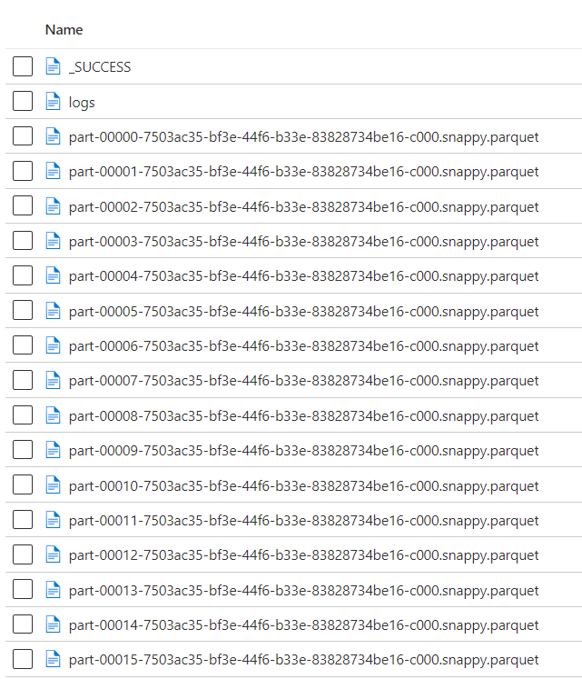

# Input File Format for Feathr

Feathr supports multiple file formats, including Parquet, ORC, Avro, JSON, Delta Lake, and CSV. The formats are recognized in the following order:

1. If the input path has a suffix, that will be honored. For example, `wasb://demodata@demodata/user_profile.csv` will be recognized as csv, while `wasb://demodata@demodata/product_id.parquet` will be recognized as parquet. Note that this is a per file behavior.
2. If the input file doesn't have a name, say `wasb://demodata@demodata/user_click_stream`, users can optionally set a parameter to let Feathr know which format to read those files. Refer to the `spark.feathr.inputFormat` setting in [Feathr Job Configuration](./feathr-job-configuration.md) for more details on how to set those, as well as for code examples. Note that this is a global setting that will apply to every input which the format is not recognized.
3. If all the above conditions are not recognized, Feathr will use `avro` as the default format.

## Special note for spark outputs

Many Spark users will use delta lake format to store the results. In those cases, the result folder will be something like this:

Please note that although the results are shown as "parquet", you should use the path of the parent folder and use `delta` format to read the folder.

# TimePartitionPattern for input files
When data sources are defined by `HdfsSource`, feathr supports `time_partition_pattern` to match paths of input data source files. For example, given time_partition_pattern = 'yyyy/MM/dd' and a 'base_path', all available input files under paths '{base_path}/{yyyy}/{MM}/{dd}' may will be visited and used as data sources.

This pattern of path will be treated as 'timestamp' of the related data for both 'get_offline_features' and 'materialize_features'. E.g If the path is '{base_path}/2020/05/20', timestamp of this piece of data would be treated as '2020-05-20'

This pattern can only be worked with aggregation features for now. It cannot be recognized for other cases.

## How to control paths to visit
Normally, it's not necessary to visit all data sources that match the path pattern. We may only need parts of them to be used in our jobs. Feathr have different ways to support that for 'get_offline_features' and 'materialize_features'. 
### For 'get_offline_features':
Paths would be visited is decided by your dataset and feature's definition. Eg. If you have a piece of data has the timestamp '2020/05/01' in your dataset and you have a feature want to be joined with it, related data source under the path '{base_path}/2020/05/01' will be visited.
### For 'materialize_features':
We can decide a time range by `BackfillTime` and `window`(in `WindowAggTransformation`) in the definition of feature. Eg. If we have a backfill_time = datetime(2020, 5, 21) and 'window=3d', then feathr will try to visit data under paths: ['{base_path}/2020/05/18', '{base_path}/2020/05/19', '{base_path}/2020/05/20'].

For more details, please check the code example as a reference:
[timePartitionPattern test cases](../../feathr_project/test/test_time_partition_pattern_e2e.py)
### Interval of time pattern
In terms of the interval or step between each time pattern, we only support 'DAILY' and 'HOURLY' for now.

The interval is decided by the pattern. Eg. For 'yyyy/MM/dd' the interval will be 'DAILY'; For 'yyyy/MM/dd/HH' the interval will be 'HOURLY'.

## Positfix Path
Feathr can also support the `timePartitionPattern` in the middle of the whole path. For this case. we need to set the `postfix_path` when define the data source.

More reference on the APIs:

- [HdfsSource API doc](https://feathr.readthedocs.io/en/latest/feathr.html#feathr.HdfsSource)