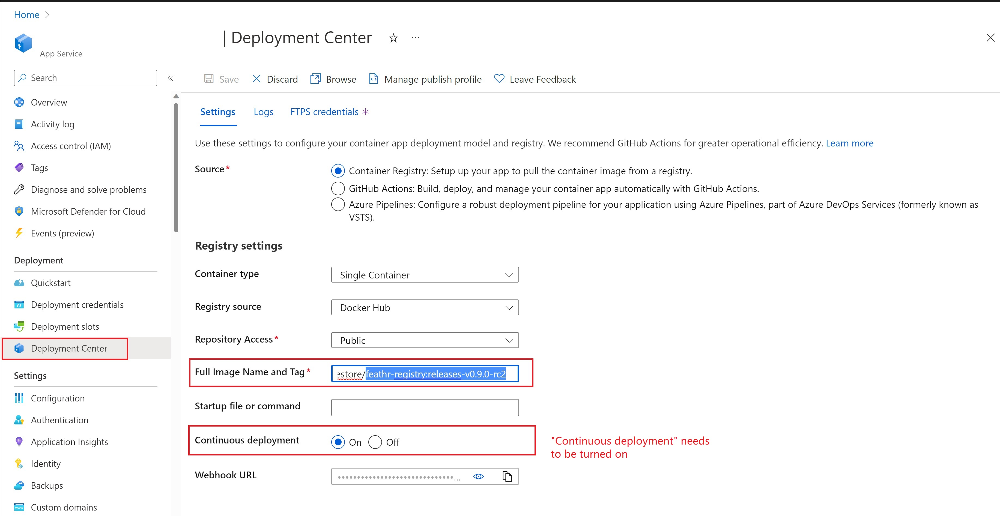

# Updating Feathr Registry and Feathr Client

Feathr has monthly releases, and usually the release contains 3 major components:

- Feathr python client, where you can install via `pip install feathr`
- Feathr spark runtime, which is published to [Maven Central](https://search.maven.org/artifact/com.linkedin.feathr/feathr_2.12)
- Feathr Registry Server, which is a docker container that is published in [DockerHub with name feathrfeaturestore/feathr-registry](https://hub.docker.com/r/feathrfeaturestore/feathr-registry/tags)

When updating Feathr, there are two steps:
1. Update the Feathr client into a specific version. You can do this by executing `pip install feathr==0.9` to a specific version, or `pip install feathr -U` to update to the latest version. Usually when end users update the Python client, the associated Spark runtime will also be updated, so end users usually don't have to update the Spark runtime unless there are specific reasons. 
2. Update the Feature Registry Server. You should go to the webapp that is hosting the UI, and find the "Deployment Center" part, and update the `Full Image Name and Tag` to the DockerHub image that you want to use, for example `feathrfeaturestore/feathr-registry:releases-v0.9.0`. Note that the "Continuous Deployment" setting needs to be set to "on", as below.
   
   

 