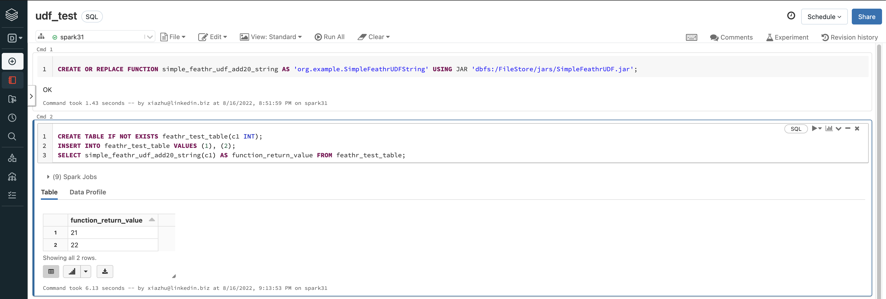

# Developing Customized Feathr Spark UDF

Feathr provides flexible ways for end users to define featurization logics. One of the advanced use case would be to use complex, customized logic to do transformations in Feathr. This document describes the required steps to do that.

Although Feathr uses Spark as the execution engine, this is transparent to end users; However, for advanced use cases such as using Spark UDF, users have to have basic knowledge on Spark.

The thinking here is to have users define arbitrary functions using Spark UDF framework, register the UDF as permanent functions in Spark, and have Feathr calling the function.

Most of the content in this document are out of Feathr's scope, but we just document the steps here to make it easier for end users to develop Spark UDFs and understand a bit more.

## Difference between Spark UDF scopes

Before we get started, there is an important concept for Spark UDF. There are two types of UDFs - UDF available in session scope, and UDFs that are shared across different sessions (permanent functions).

For example, in the [Scalar User Defined Functions (UDFs)](https://spark.apache.org/docs/latest/sql-ref-functions-udf-scalar.html) in Spark, there is an example like this:

```scala
val spark = SparkSession
  .builder()
  .appName("Spark SQL UDF scalar example")
  .getOrCreate()

spark.udf.register("oneArgFilter", (n: Int) => { n > 5 })
spark.range(1, 10).createOrReplaceTempView("test")
spark.sql("SELECT * FROM test WHERE oneArgFilter(id)").show()
```

The way `spark.udf.register("oneArgFilter", (n: Int) => { n > 5 })` is called indicates that this UDF is a session scoped UDF, and cannot be shared across different sessions.

Instead, if we want to share the UDFs across different sessions, we should call the CREATE FUNCTION statement, which is used to create a temporary or permanent function in Spark, like below. Refer to the [Spark documentation](https://spark.apache.org/docs/latest/sql-ref-syntax-ddl-create-function.html) to learn more.

```SQL
CREATE OR REPLACE FUNCTION simple_feathr_udf_add20_string AS 'org.example.SimpleFeathrUDFString' USING JAR 'dbfs:/FileStore/jars/SimpleFeathrUDF.jar';
```

Basically, temporary functions are scoped at a session level where as permanent functions are created in the persistent catalog and are made available to all sessions. The resources specified in the USING clause are made available to all executors when they are executed for the first time.

## Step 1: Creating a JAR package for the UDF

According to the [Spark documentation](https://spark.apache.org/docs/latest/sql-ref-syntax-ddl-create-function.html), end users need to implement a class extending one of the base classes like below:

- Should extend UDF or UDAF in org.apache.hadoop.hive.ql.exec package.
- Should extend AbstractGenericUDAFResolver, GenericUDF, or GenericUDTF in org.apache.hadoop.hive.ql.udf.generic package.
- Should extend UserDefinedAggregateFunction in org.apache.spark.sql.expressions package.

Currently, only row level transformation is supported in Feathr. I.e. you should always extend `org.apache.hadoop.hive.ql.exec`.

## Write a simple UDF

For example we can develop a Java class like below, creating a new class called `SimpleFeathrUDFString` which takes a string as input, parse it, and return a number plus 20.

```java
package org.example;

import org.apache.hadoop.hive.ql.exec.UDF;

public class SimpleFeathrUDFString extends UDF {
   public int evaluate(String value) {
        int number = Integer.parseInt(value);
        return number + 20;
    }
}
```

The corresponding `pom.xml` will be like below. Remember to have `org.apache.hive:hive-exec` and `org.apache.hadoop:hadoop-common` as dependencies so that the Jar can be compiled successfully:

```xml
<?xml version="1.0" encoding="UTF-8"?>
<project xmlns="http://maven.apache.org/POM/4.0.0"
         xmlns:xsi="http://www.w3.org/2001/XMLSchema-instance"
         xsi:schemaLocation="http://maven.apache.org/POM/4.0.0 http://maven.apache.org/xsd/maven-4.0.0.xsd">
    <modelVersion>4.0.0</modelVersion>

    <groupId>org.example</groupId>
    <artifactId>SimpleFeathrUDF</artifactId>
    <version>1.0-SNAPSHOT</version>
    <dependencies>

        <dependency>
            <groupId>org.apache.hive</groupId>
            <artifactId>hive-exec</artifactId>
            <version>3.1.3</version>
        </dependency>
        <dependency>
            <groupId>org.apache.hadoop</groupId>
            <artifactId>hadoop-common</artifactId>
            <version>3.3.1</version>
        </dependency>

    </dependencies>

    <properties>
        <maven.compiler.source>8</maven.compiler.source>
        <maven.compiler.target>8</maven.compiler.target>
    </properties>

</project>
```

Compile the result to a Jar file. For example, if you are using IDEs such as IntelliJ, you can create an artifact like this:


After that, you should have a jar file containing your UDF code.

## Step 2: Upload the JAR to the Spark cluster and register the UDF

The second step is to upload the jar that we just compiled to a shared location, and have it registered in the Spark environment.

For databricks, you can upload it to the DBFS that your current spark cluster is using, like below:


For Synapse, you can upload the jar to the default storage account that the spark cluster is associated with.

After uploading the JAR, you should register the UDF as a permanent UDF like this. Usually it is a one-time task, so you can use the built-in notebooks in Spark cluster to do this.

For example, in databricks, you can login to the notebook and execute the command below:


```SQL
CREATE OR REPLACE FUNCTION simple_feathr_udf_add20_string AS 'org.example.SimpleFeathrUDFString' USING JAR 'dbfs:/FileStore/jars/SimpleFeathrUDF.jar';
```

For more on the syntax, refer to the [spark docs](https://spark.apache.org/docs/latest/sql-ref-syntax-ddl-create-function.html).

You can test if the UDF is registered in Spark or not by typing those in the notebook environment:

```SQL
CREATE TABLE IF NOT EXISTS feathr_test_table(c1 INT);
INSERT INTO feathr_test_table VALUES (1), (2);
SELECT simple_feathr_udf_add20_string(c1) AS function_return_value FROM feathr_test_table;
```

## Step 3: Using the UDF in Feathr

The only caveat here is to disable Feathr from doing more optimizations. Since Feathr is designed to optimize for large scale workloads, and UDFs are black boxes to optimizer, so we need to disable some of the Feathr optimizations, such as bloom filters, to allow UDFs to run.

This is straightforward to do. In Feathr, when calling `get_offline_features` or `materialize_features` APIs, you need to specify `execution_configurations={"spark.feathr.row.bloomfilter.maxThreshold":"0"}` so that Feathr don't optimize for the UDFs, like below:

```python
client.get_offline_features(observation_settings=settings,
                            feature_query=feature_query,
                            output_path=output_path,
                            execution_configurations={"spark.feathr.row.bloomfilter.maxThreshold":"0"}
                           )

```

```python
client.materialize_features(settings, execution_configurations={"spark.feathr.row.bloomfilter.maxThreshold":"0"})
```

That's it! Using the UDF just as regular Spark functions. For example, we might want to define a feature like this:

```python
Feature(name="f_udf_transform",
        feature_type=INT32,
        transform="simple_feathr_udf_add20_string(PULocationID)")
```

And you will see the result like this, where we have called `f_udf_transform` and it transforms the `PULocationID` column and adding 20 to the value there.


For more details on how to call those UDFs in Feathr, please refer to the [Feathr User Defined Functions (UDFs) document](../concepts/feathr-udfs.md).
