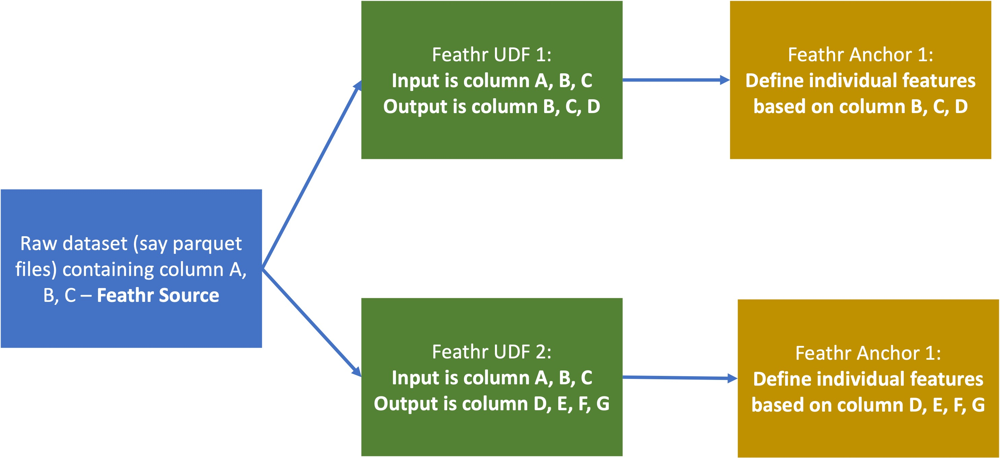

# Feathr User Defined Functions (UDFs)

Feathr supports a wide range of user defined functions (UDF) to allow flexible way of dealing with your data. Feathr supports two use cases:

1. [UDF at input sources (also known as preprocessing functions)](#udfs-at-input-sources-also-known-as-preprocessing-functions)
2. [UDF at individual features (using the `transform` parameters)](#udfs-at-individual-features-using-the-transform-parameters)

## UDF at input sources (also known as preprocessing functions)

Below is an example:

```python
def add_new_dropoff_and_fare_amount_column(df: DataFrame):
    from pyspark.sql import SparkSession, DataFrame
    from pyspark.sql.functions import col
    df = df.withColumn("f_day_of_week", dayofweek("lpep_dropoff_datetime"))
    df = df.withColumn("fare_amount_cents", df.fare_amount.cast('double') * 100)
    return df

batch_source = HdfsSource(name="nycTaxiBatchSource",
                        path="abfss://feathrazuretest3fs@feathrazuretest3storage.dfs.core.windows.net/demo_data/green_tripdata_2020-04.csv",
                        preprocessing=add_new_dropoff_and_fare_amount_column,
                        event_timestamp_column="new_lpep_dropoff_datetime",
                        timestamp_format="yyyy-MM-dd HH:mm:ss")
```

As you can see, there are two parts:

1. A self-contained UDF function
2. Calling that function in `preprocessing` parameter.

### What happened behind the scene and what is the limitation?

What's happening behind the scene is, Feathr will copy the function (`add_new_dropoff_and_fare_amount_column` in this case) and execute the function in the corresponding Spark cluster.

The execution order will be:

1. Read from source
2. Execute UDF and produce new tables
3. The new tables is used to define features

There are several limitations:

1. The functions should be "self-contained". I.e. If you use any python module or Spark function, you should import the python module in the UDF function body. Although Feathr already imports all the [Spark SQL built-in functions](https://spark.apache.org/docs/latest/api/sql/index.html) in `pyspark.sql.functions` namespace, it is always a best practice to import the modules in the UDF body. They might be other python modules you use, for example `time`, regex, etc., or Spark SQL functions, such as the `from pyspark.sql.functions import dayofweek` line in the example below.
2. The function should accept only one Spark Dataframe as input, and return one Spark Dataframe as the result. Multiple DataFrames are not supported. There's no limitation on names, and by convention it is usually called `df`, but you can use any name you want.
3. The "contract" between users and Feathr here is - as long as you give the UDF a dataframe as an input and the output is a dataframe, then Feathr will accept and run this UDF function.
4. For all the feature definitions, you should use the output of the UDF as the new column name (if you have changed the name of the columns). For example, you have the following code, then you won't be able to use `fare_amount_cents` in your feature definition, since it is not in the output dataframe of this UDF because it's dropped from the result dataframe. However, you will be able to use `f_day_of_week` in your feature definition, since it is a column that is created in the result dataframe..

```python
def add_new_dropoff_and_fare_amount_column(df: DataFrame):
    from pyspark.sql.functions import dayofweek
    df = df.withColumn("f_day_of_week", dayofweek("lpep_dropoff_datetime"))
    df = df.drop("fare_amount_cents")
    return df
```

4. Currently, "chained" functions are not supported. I.e. the example below is not supported:

```python
def multiply_100(input_val):
  return input_val * 100

def add_new_dropoff_and_fare_amount_column(df: DataFrame):
    from pyspark.sql.functions import dayofweek
    df = df.withColumn("f_day_of_week", dayofweek("lpep_dropoff_datetime"))
    df = df.withColumn("fare_amount_cents",  multiply_100("fare_amount"))
    return df
```

Per the first limitation (i.e. the functions should be self-contained), you should consider the following way:

```python
def add_new_dropoff_and_fare_amount_column(df: DataFrame):
    from pyspark.sql.functions import dayofweek
    df = df.withColumn("f_day_of_week", dayofweek("lpep_dropoff_datetime"))

    def multiply_100(input_val):
      return input_val * 100

    df = df.withColumn("fare_amount_cents",  multiply_100("fare_amount"))
    return df
```

### Best Practices

One best practice is if you have multiple transformation that you want to define for one input source, you can define multiple UDFs. For example, for the same input source, you can define different input UDFs and define completely different features over those two UDFs. Refer to [Illustration on How Feathr UDF works](#illustration-on-how-feathr-udf-works) for an illustration.

### UDF with PySpark Support

Feathr supports using regular pyspark:

```python
def add_new_dropoff_and_fare_amount_column(df: DataFrame):
    from pyspark.sql.functions import dayofweek
    df = df.withColumn("f_day_of_week", dayofweek("lpep_dropoff_datetime"))
    df = df.withColumn("fare_amount_cents", df.fare_amount.cast('double') * 100)
    return df
```

### UDF with Spark SQL Support

Feathr also supports using a SQL dialect to deal with your data. Below is the template, note that:

1. You should declare a global "spark" session so that it can be called later
2. You should call `createOrReplaceTempView` so that you can refer to this view in your SQL code

```python
from pyspark.sql import SparkSession, DataFrame
def feathr_udf_filter_location_id(df: DataFrame) -> DataFrame:
  # if using Spark SQL, need to declare this default spark session, and create a temp view so that you can run Spark SQL on it.
  global spark
  df.createOrReplaceTempView("feathr_temp_table_feathr_udf_day_calc")
  sqlDF = spark.sql(
  """
  SELECT *
  FROM feathr_temp_table_feathr_udf_day_calc
  WHERE DOLocationID!= 100
  """
  )
  return sqlDF
```

### UDF with Pandas Example:

Feathr also supports using pandas to deal with the data. Behind the scene it's using pandas-on-spark so some limitation applies here. Please refer to [Pandas-on-Spark's Best Practice](https://spark.apache.org/docs/latest/api/python/user_guide/pandas_on_spark/best_practices.html#best-practices) for more details.

Below is the template, note that:

1. This is only available for Spark 3.2 and later, so make sure you submit to a spark cluster that has Spark 3.2 and later.
2. You need to call something like `psdf = df.to_pandas_on_spark()` to convert a Spark dataframe to "pandas dataframe", and call `psdf.to_spark()` to convert the "pandas dataframe" to Spark dataframe.

```python
def feathr_udf_pandas_spark(df: DataFrame) -> DataFrame:
  # using pandas on spark APIs. Fore more details, refer to the doc here: https://spark.apache.org/docs/latest/api/python/user_guide/pandas_on_spark/index.html
  # Note that this API is only available for Spark 3.2 and later, so make sure you submit to a spark cluster that has Spark 3.2 and later.
  psdf = df.to_pandas_on_spark()
  psdf['fare_amount_cents'] = psdf['fare_amount']*100
  # need to make sure converting the pandas-on-spark dataframe to Spark Dataframe.
  return psdf.to_spark()

batch_source = HdfsSource(name="nycTaxiBatchSource",
                        path="abfss://feathrazuretest3fs@feathrazuretest3storage.dfs.core.windows.net/demo_data/green_tripdata_2020-04.csv",
                        preprocessing=add_new_dropoff_and_fare_amount_column,
                        event_timestamp_column="new_lpep_dropoff_datetime",
                        timestamp_format="yyyy-MM-dd HH:mm:ss")
```

### When do I use UDFs?

Those UDFs are totally optional to use. For example, if you have an existing feature transformation pipeline, you don't have to use Feathr's preprocessing functions to rewrite your code. Instead, you can simply use your already transformed feature in Feathr, for point in time joins, or for feature registry and exploration.

But if you don't have an existing pipeline, Feathr's UDF does provide a good way for you to manage your feature engineering system from end to end. This decision is beyond the scope of this document.

## UDF at individual features (using the `transform` parameters)

Other than the UDF in the input level, Feathr also allows some level of customizations in the individual feature level. This is very useful if users want to do some last mile transformation, or for derived features where users might want to compose a new feature based on a few existing features with some calculation.

For those row-level transformations, [Spark SQL built-in functions](https://spark.apache.org/docs/latest/api/sql/index.html) are supported. For example you can call [`dayofmonth`](https://spark.apache.org/docs/latest/api/sql/index.html#dayofmonth), [`xpath_double`](https://spark.apache.org/docs/latest/api/sql/index.html#xpath_double), or [`percent_rank`](https://spark.apache.org/docs/latest/api/sql/index.html#percent_rank) etc. in the Spark SQL built-in functions in the `transformation` parameter for Feathr.

Some examples are shown below. Note that usually they are row level transformations, and if you want to do some aggregations across rows, please check out [Window aggregation features](../concepts/feature-definition.md#window-aggregation-features).

```python
derived_feature = DerivedFeature(name="f_trip_time_distance",
                                 feature_type=FLOAT,
                                 key=trip_key,
                                 input_features=[f_trip_distance, f_trip_time_duration],
                                 transform="f_trip_distance * cos(f_trip_time_duration)")

 feature = Feature(name="f_day_of_week",
            feature_type=INT32,
            transform="dayofweek(lpep_dropoff_datetime)") 
```

## Illustration on How Feathr UDF works


