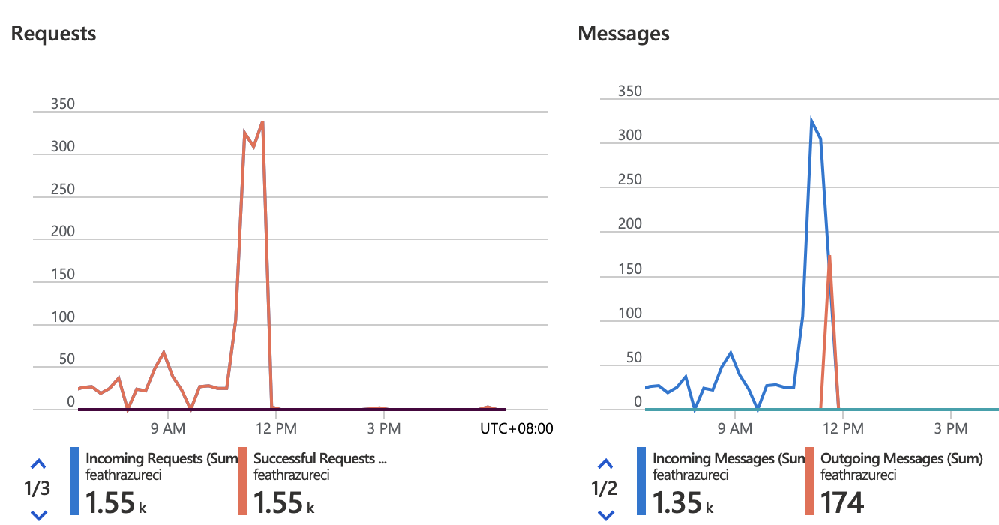

# Streaming Source Ingestion and Feature Definition

Feathr supports defining features from a stream source (for example Kafka) with transformations, and sink the features into an online store (such as Redis). This is very useful if you need up-to-date features for online store, for example when user clicks on the website, that web log event is usually sent to Kafka, and data scientists might need some features immediately, such as the browser used in this particular event. The steps are as below:

## Define Kafka streaming input source

Currently only Avro format is supported, so users need to specify `AvroJsonSchema` as below:

```python
# Define input data schema
schema = AvroJsonSchema(schemaStr="""
{
    "type": "record",
    "name": "DriverTrips",
    "fields": [
        {"name": "driver_id", "type": "long"},
        {"name": "trips_today", "type": "int"},
        {
        "name": "datetime",
        "type": {"type": "long", "logicalType": "timestamp-micros"}
        }
    ]
}
""")
stream_source = KafKaSource(name="kafkaStreamingSource",
                            kafkaConfig=KafkaConfig(brokers=["feathrazureci.servicebus.windows.net:9093"],
                                                    topics=["feathrcieventhub"],
                                                    schema=schema)
                            )
```

You may need to produce data and send them into Kafka as this data source in advance. Please check [Kafka data source producer](https://github.com/feathr-ai/feathr/blob/main/feathr_project/test/prep_azure_kafka_test_data.py) as a reference. Also you should keep this producer running which means there are data stream keep coming into Kafka while calling the 'materialize_features' below.

## Define feature definition with the Kafka source

You can then define features. They are mostly the same with the [regular feature definition](../concepts/feature-definition.md).

Note that for the `transform` part, only row level transformation is allowed in streaming anchor at the moment, i.e. the transformations listed in [Spark SQL Built-in Functions](https://spark.apache.org/docs/latest/api/sql/) are supported. Users can also define customized [Spark SQL functions](./feathr-spark-udf-advanced.md).

For example, you can specify to do a row-level transformation like `trips_today + randn() * cos(trips_today)` for your input data.

```python
driver_id = TypedKey(key_column="driver_id",
                     key_column_type=ValueType.INT64,
                     description="driver id",
                     full_name="nyc driver id")

kafkaAnchor = FeatureAnchor(name="kafkaAnchor",
                            source=stream_source,
                            features=[Feature(name="f_modified_streaming_count",
                                              feature_type=INT32,
                                              transform="trips_today + 1",
                                              key=driver_id),
                                      Feature(name="f_modified_streaming_count2",
                                              feature_type=INT32,
                                              transform="trips_today + randn() * cos(trips_today)",
                                              key=driver_id)]
                            )

```

## Start streaming job

You can then start a streaming job and stream all the features into online store, such as Redis:

```python
redisSink = RedisSink(table_name="kafkaSampleDemoFeature", streaming=True, streamingTimeoutMs=10000)
# The 'streamingTimeoutMs' parameter may need to be increased, such as 10min or even longer, to make sure some data sources from Kafka was captured.
settings = MaterializationSettings(name="kafkaSampleDemo",
                                   sinks=[redisSink],
                                   feature_names=['f_modified_streaming_count']
                                   )
client.materialize_features(settings) # Will streaming for 10 seconds since streamingTimeoutMs is 10000
```

## Fetch streaming feature values

And finally get the relevant features from online store:

```python
res = client.get_online_features('kafkaSampleDemoFeature', '1',['f_modified_streaming_count'])
# Get features for multiple feature keys
res = client.multi_get_online_features('kafkaSampleDemoFeature', ['1', '2'], ['f_modified_streaming_count'])

```

You can also refer to the [test case](https://github.com/feathr-ai/feathr/blob/main/feathr_project/test/test_azure_kafka_e2e.py) for more details.

## Kafka configuration

Please refer to the [Feathr Configuration Doc](./feathr-configuration-and-env.md#KAFKA_SASL_JAAS_CONFIG) for more details on the credentials.

## Event Hub monitoring

If you feel something is wrong, you can check the monitor panel on your 'Event Hub' overview page while running the Feathr materialization job, to make sure there are both incoming and outgoing messages, like the graph below. Otherwise, you may not get anything from `get_online_features()` since the source is empty.


