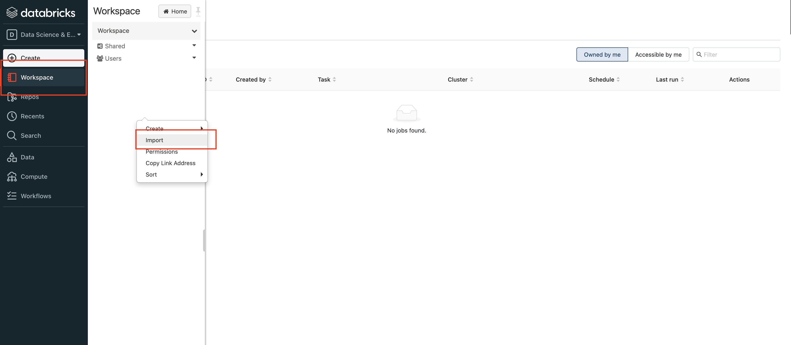
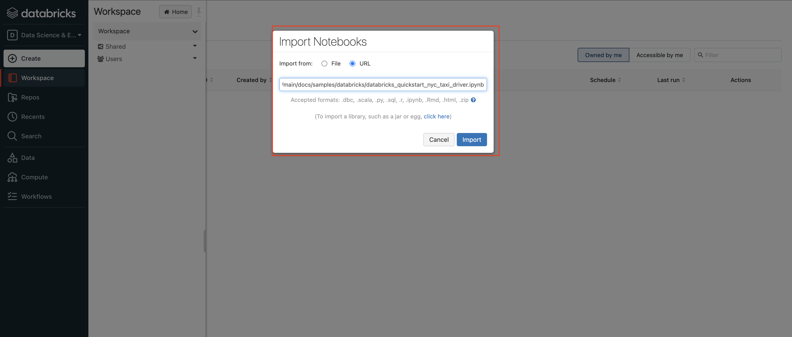

# Feathr Quick Start Guide with Databricks

For Databricks, you can simply upload [this notebook](./samples/databricks/databricks_quickstart_nyc_taxi_driver.ipynb) to your Databricks cluster and just run it in the Databricks cluster. It has been pre-configured to use the current Databricks cluster to submit jobs.

1. Import Notebooks in your Databricks cluster:

2. Paste the [link to Databricks getting started notebook](./samples/databricks/databricks_quickstart_nyc_taxi_driver.ipynb):

3. Run the whole notebook. It will automatically install Feathr in your cluster and run the feature ingestion jobs.
