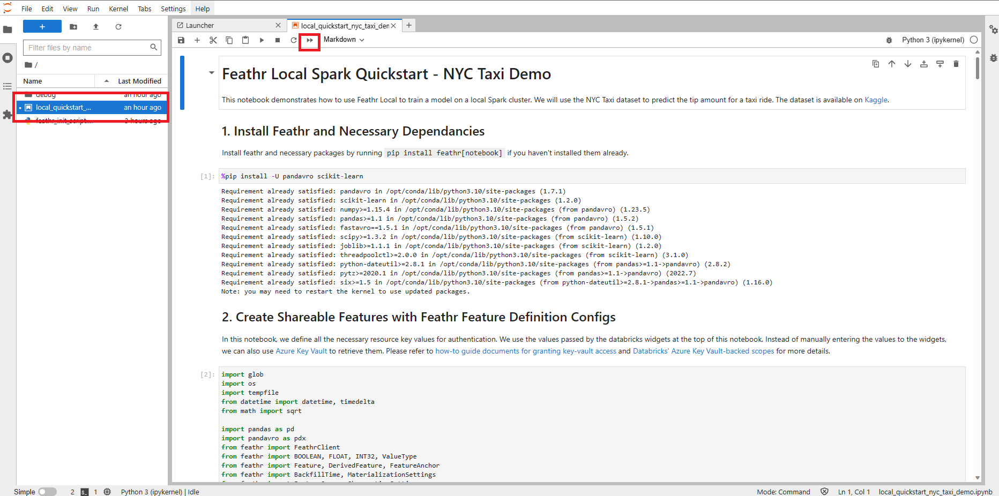
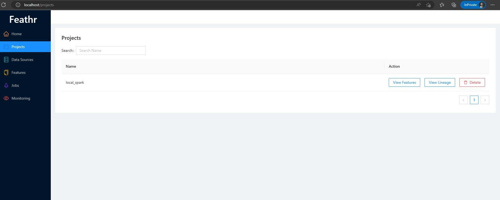
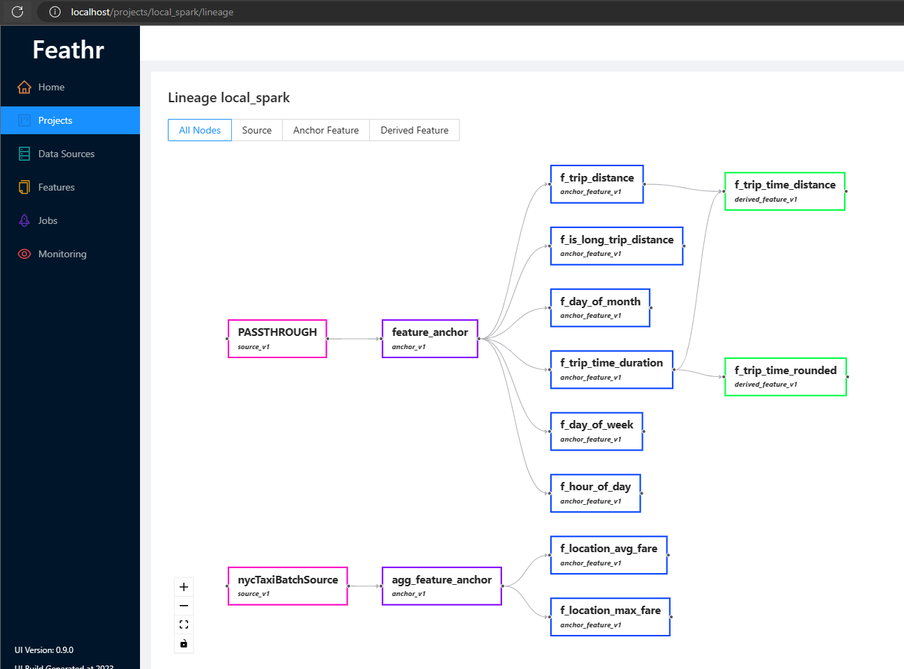
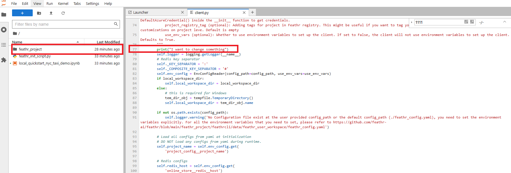

# Feathr Quick Start Guide with Local Sandbox

We provide a local sandbox so users can use Feathr easily. The goal of the Feathr Sandbox is to:

- make it easier for users to get started, 
- make it easy to validate feature definitions and new ideas
- make it easier for Feathr developers to setup environment and develop new things
- Interactive experience, usually try to run a job takes less than 1 min.

As an end user, you can become productive in less than 5 mins and try out Feathr.

The Sandbox is ideal for:

- Feathr users who want to get started quickly
- Feathr developers to test new features since this docker should everything they need. It comes with the python package as editable model so developers can iterate easily. 

## Getting Started

First, make sure you have docker installed successfully on your machine by running this command:

```bash
docker run hello-world
```

To get started using Feathr, simply run the command below. Note that the image is around 5GB so it might take a while to pull it from DockerHub.

```bash
# 80: Feathr UI 8000: Feathr API 8888: Jupyter 8080: VsCode 7080: Interpret
docker run -it --rm -p 8888:8888  -p 8000:8000 -p 8081:80 -p 8080:8080 -p 7080:7080 --env API_BASE="api/v1" --env FEATHR_SANDBOX=True -e GRANT_SUDO=yes feathrfeaturestore/feathr-sandbox
```

It should pop up a Jupyter link in `http://127.0.0.1:8888/`. Double click on the notebook file to start the Jupyter Notebook, and you should be able to see the Feathr sample notebook. Click the triangle button on the Jupyter notebook and the whole notebook will run locally.

If you see some errors like below, simply change the `-p 8081:80` part to `-p <new port>:80` so the Feathr UI will be redirected to the new port.

`docker: Error response from daemon: driver failed programming external connectivity on endpoint hardcore_bose (ae107e924cddce6b942f96f2654369345b027ac82e5e44929a9f132e2af71746): Bind for 0.0.0.0:8081 failed: port is already allocated.`

The default jupyter notebook is here:
```bash
http://localhost:8888/lab/workspaces/auto-w/tree/local_quickstart_notebook.ipynb
```




After running the Notebooks, all the features will be registered in the UI, and you can visit the Feathr UI at:

```bash
http://localhost:8081
```


After executing those scripts, you should be able to see a project called `local_spark` in the Feathr UI. You can also view lineage in the Feathr UI and explore all the details.




## Components

The Feathr sandbox comes with:
- Built-in Jupyter Notebook
- Pre-installed data science packages such as `interpret` so that data science development becomes easy
- Pre-installed Feathr package
- A local spark environment for dev/test purpose
- Feathr samples that can run locally
- A local Feathr registry backed by SQLite
- Feathr UI
- Feathr Registry API
- Local Redis server


## Build Docker Container

If you want to build the Feathr sandbox, run the below command in the Feathr root directory:

```bash
docker build -f FeathrSandbox.Dockerfile -t feathrfeaturestore/feathr-sandbox .
```


## For Feathr Developers
The Feathr package is copied to the user folder, and is installed with `pip install -e` option, which means you can do interactive development in the python package. For example you want to validate changes, instead of setting up the environment, you can simply go to the 


note that if you are using Jupyter notebook to run the code, make sure you restart jupyter notebook so the kernel can reload Feathr package.
You should be able to see the 



In the future, an VSCode Server might be installed so that you can do interactive development in the docker container.
