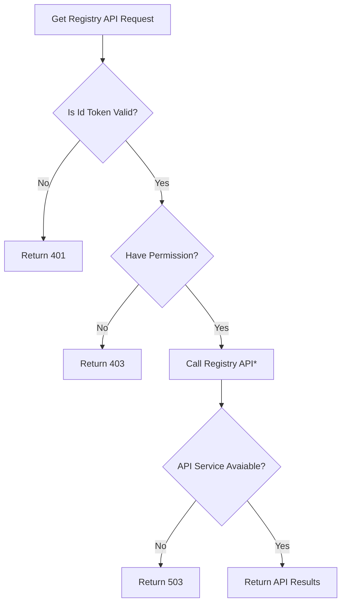

# Feathr Registry Access Control Gateway Specifications

## Registry API with Access Control Gateway

**Access Control Gateway** is an access control **Plugin** component of feature registry API. It can work with different type of backend registry. When user enables this component, registry requests will be validated in a gateway as below flow chart:

If Access control component is NOT enabled, the flow will start from **Call Registry API***

## Acess Control Rules

- For all **get** requests, check **read** permission for certain project.
- For all **post** request, check **write** permission for certain project.
- For all **access control management** request, check **manage** permission for certian project.
- In case of feature level query, will verify the parent project access of the feature.
- Registry API calls and returns will be transparently transfered.
- A header `x-access-control-enabled` will be added for API calls protected by access control gateway

## Management Rules

### Initialize `userroles` table

In current version, user needs to mannually initialze `userroles` table admins in SQL table.
When `create_registry` and `create_project` API is enabled, default admin role will be assgined to the creator.
Admin roles can add or delete roles in management UI page or thorugh management API.
