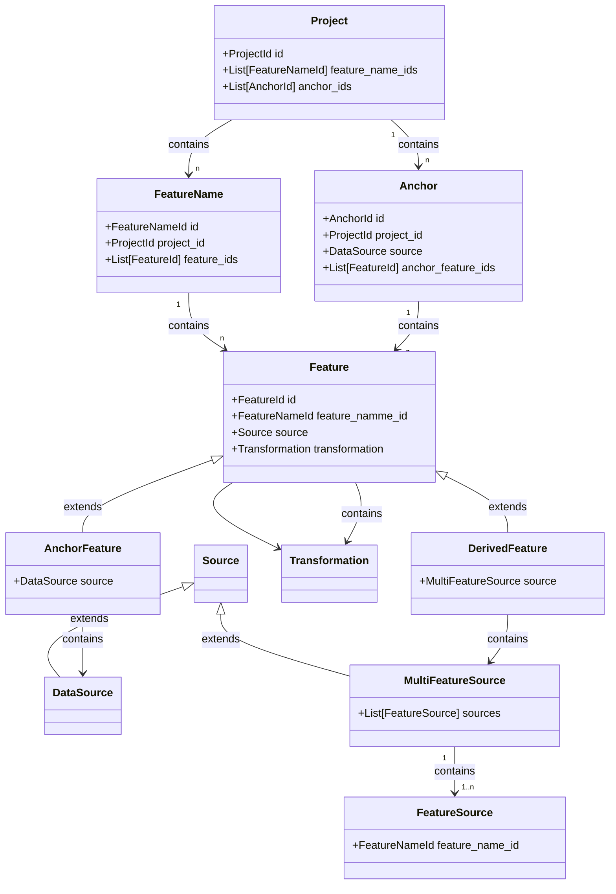

# Feathr Abstract backend Data Model Diagram

This file defines abstract backend data models diagram for feature registry.
[Python Code](./models.py)

```mermaid
classDiagram
    Project "1" --> "n" FeatureName : contains
    Project "1" --> "n" Anchor : contains
    FeatureName "1" --> "n" Feature : contains
    Anchor "1" --> "n" Feature : contains
    Feature <|-- AnchorFeature : extends
    Feature <|-- DerivedFeature: extends
    Feature --> Transformation
    Feature  -->  Transformation : contains
    Source <|-- DataSource: extends
    Source <|-- MultiFeatureSource: extends
    MultiFeatureSource "1" --> "1..n" FeatureSource: contains
    AnchorFeature  -->  DataSource : contains
    DerivedFeature -->  MultiFeatureSource: contains

    class Source{
    }
    class DataSource{
    }
    class FeatureSource{
        +FeatureNameId feature_name_id
    }
    class MultiFeatureSource{
        +List[FeatureSource] sources
    }
    class Feature{
        +FeatureId id
        +FeatureNameId feature_namme_id
        +Source source
        +Transformation transformation
    }
    class AnchorFeature{
        +DataSource source
    }
    class DerivedFeature{
        +MultiFeatureSource source
    }
    class FeatureName{
        +FeatureNameId id
        +ProjectId project_id
        +List[FeatureId] feature_ids
    }
    class Project{
        +ProjectId id
        +List[FeatureNameId] feature_name_ids
        +List[AnchorId] anchor_ids
    }
    class Anchor{
        +AnchorId id
        +ProjectId project_id
        +DataSource source
        +List[FeatureId] anchor_feature_ids
    }
```